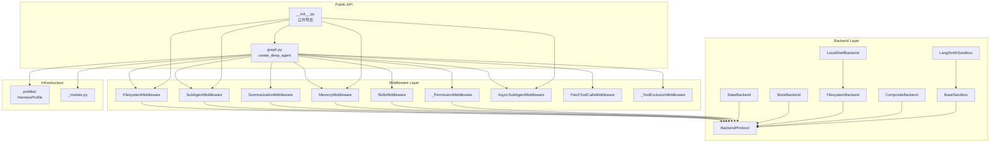
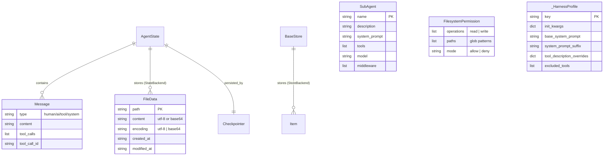
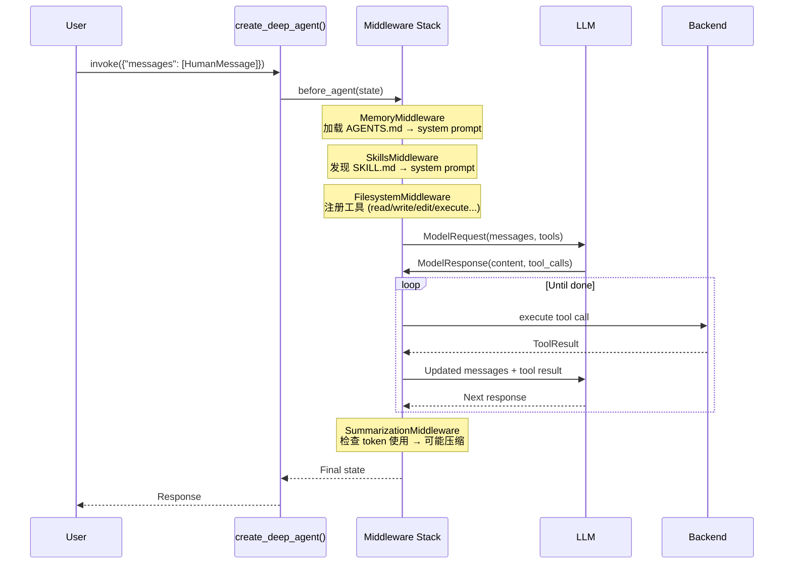
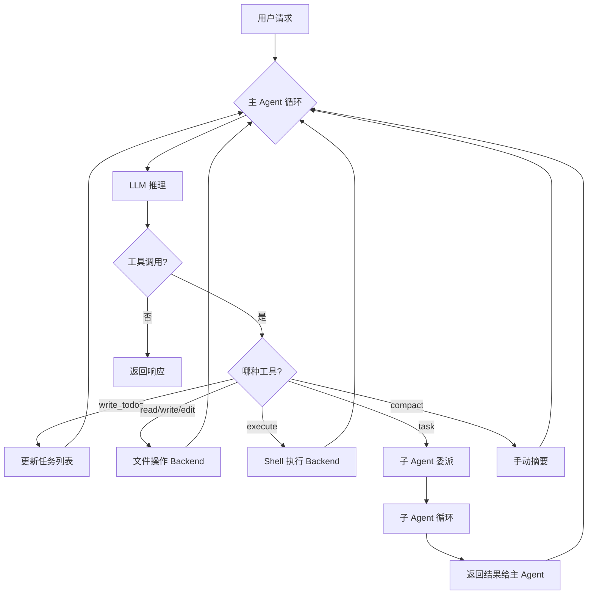
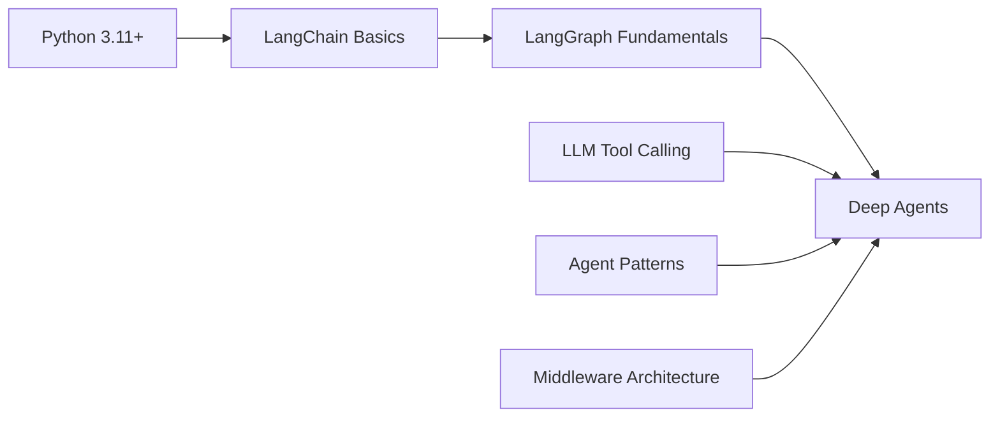

# DeepAgents 完整深度研究报告

> **仓库：** [langchain-ai/deepagents](https://github.com/langchain-ai/deepagents)
> **版本：** v0.5.3 | **许可证：** MIT | **研究日期：** 2026-04-24

---

## Part 1: 项目概述

### 1.1 Project Identity & Purpose

Deep Agents 是 LangChain 团队打造的 **"开箱即用" Agent 框架（Agent Harness）**，灵感来源于 Claude Code。它提供了一套完整的 Agent 运行时，包括任务规划、文件系统操作、Shell 执行、子 Agent 委派和上下文自动摘要。

**关键指标：**

| 指标 | 值 |
|------|-----|
| 组织 | langchain-ai (LangChain Inc.) |
| 语言 | Python (核心) + TypeScript (CLI) |
| 版本 | 0.5.3 (Beta) |
| 许可证 | MIT |
| Python 要求 | ≥3.11, <4.0 |
| 源文件数 | ~461 个 .py 文件 |
| 测试代码行数 | ~29,098 行 |

**目标用户：** 需要 AI Agent 完成复杂任务的开发者，特别是需要文件操作、代码执行和多 Agent 协作的场景。

### 1.2 Technology Stack Fingerprint

| 层面 | 技术 |
|------|------|
| 语言 | Python 3.11+ |
| 核心框架 | LangGraph (Agent 运行时), LangChain (Agent/Middleware API) |
| LLM 适配 | langchain-anthropic, langchain-google-genai, langchain-openai |
| 沙箱 | LangSmith Sandbox, Daytona, Modal, Runloop |
| 构建工具 | setuptools + wheel |
| 代码质量 | ruff (lint + format), ty (type checking), pytest |
| CLI | 独立 Rust/TS 实现 (`libs/cli/`) |
| 包管理 | uv + pyproject.toml |

**核心依赖** (`libs/deepagents/pyproject.toml`):
```
langchain-core>=1.2.27, langsmith>=0.3.0, langchain>=1.2.15,
langchain-anthropic>=1.4.0, langchain-google-genai>=4.2.1, wcmatch
```

### 1.3 High-Level Architecture

```
┌──────────────────────────────────────────────────────┐
│                   create_deep_agent()                  │
│                  (libs/deepagents/deepagents/graph.py) │
├──────────────────────────────────────────────────────┤
│  System Prompt Layer                                  │
│  ┌─────────┐  ┌────────┐  ┌────────────────────────┐ │
│  │ Custom  │→ │ Base   │→ │ Profile Suffix         │ │
│  │ Prompt  │  │ Prompt │  │ (provider-specific)    │ │
│  └─────────┘  └────────┘  └────────────────────────┘ │
├──────────────────────────────────────────────────────┤
│  Middleware Stack (ordered pipeline)                   │
│  ┌──────────────────────────────────────────────┐    │
│  │ 1. TodoListMiddleware        (planning)       │    │
│  │ 2. SkillsMiddleware          (on-demand)      │    │
│  │ 3. FilesystemMiddleware      (file ops)       │    │
│  │ 4. SubAgentMiddleware        (delegation)     │    │
│  │ 5. SummarizationMiddleware   (context mgmt)   │    │
│  │ 6. PatchToolCallsMiddleware  (cleanup)        │    │
│  │ 7. AsyncSubAgentMiddleware   (remote tasks)   │    │
│  │ ─── User Middleware (injection point) ───     │    │
│  │ 8. _ToolExclusionMiddleware  (per-model)      │    │
│  │ 9. AnthropicPromptCachingMW  (optimization)   │    │
│  │10. MemoryMiddleware          (AGENTS.md)      │    │
│  │11. HumanInTheLoopMiddleware  (approval)       │    │
│  │12. _PermissionMiddleware     (access control) │    │
│  └──────────────────────────────────────────────┘    │
├──────────────────────────────────────────────────────┤
│  Backend Layer (pluggable storage/execution)          │
│  ┌────────────┐ ┌────────────┐ ┌──────────────┐     │
│  │ State      │ │ Filesystem │ │ Composite     │     │
│  │ Backend    │ │ Backend    │ │ Backend       │     │
│  ├────────────┤ ├────────────┤ ├──────────────┤     │
│  │ Store      │ │ LocalShell │ │ LangSmith     │     │
│  │ Backend    │ │ Backend    │ │ Sandbox       │     │
│  └────────────┘ └────────────┘ └──────────────┘     │
├──────────────────────────────────────────────────────┤
│  Runtime: LangGraph CompiledStateGraph                 │
└──────────────────────────────────────────────────────┘
```

### 1.4 Repository Structure Map

```
deepagents/
├── libs/
│   ├── deepagents/              # 🔑 核心库
│   │   ├── deepagents/
│   │   │   ├── __init__.py      # 公共 API 导出
│   │   │   ├── graph.py         # 🚀 create_deep_agent() 入口
│   │   │   ├── _models.py       # 模型解析/初始化
│   │   │   ├── backends/        # 存储后端抽象层
│   │   │   │   ├── protocol.py  # BackendProtocol 接口定义
│   │   │   │   ├── state.py     # StateBackend (ephemeral)
│   │   │   │   ├── store.py     # StoreBackend (persistent)
│   │   │   │   ├── filesystem.py# FilesystemBackend (local FS)
│   │   │   │   ├── local_shell.py# LocalShellBackend (exec)
│   │   │   │   ├── sandbox.py   # BaseSandbox 抽象类
│   │   │   │   ├── langsmith.py # LangSmithSandbox
│   │   │   │   ├── composite.py # CompositeBackend (路由)
│   │   │   │   └── utils.py     # 共享工具函数
│   │   │   ├── middleware/       # 中间件管线
│   │   │   │   ├── filesystem.py
│   │   │   │   ├── subagents.py
│   │   │   │   ├── summarization.py
│   │   │   │   ├── memory.py
│   │   │   │   ├── skills.py
│   │   │   │   ├── permissions.py
│   │   │   │   ├── async_subagents.py
│   │   │   │   └── patch_tool_calls.py
│   │   │   └── profiles/         # 模型/提供商配置
│   │   ├── tests/                # 单元/集成/基准测试
│   │   └── pyproject.toml
│   ├── acp/                     # Agent Communication Protocol 服务器
│   ├── cli/                     # 独立 CLI 工具 (Rust/TS)
│   ├── repl/                    # langchain-repl 包
│   ├── evals/                   # 评估框架
│   └── partners/                # 第三方沙箱适配
│       ├── daytona/
│       ├── modal/
│       ├── runloop/
│       └── quickjs/
├── examples/                    # 示例项目 (~15+)
├── .github/workflows/           # CI/CD
├── action.yml                   # GitHub Action
└── AGENTS.md                    # 项目级 Agent 指令
```

### 1.5 Core Modules & Components

| 模块 | 路径 | 职责 |
|------|------|------|
| **Graph Assembly** | `graph.py` | 主入口，组装完整的 Agent pipeline |
| **Backend Protocol** | `backends/protocol.py` | 定义存储/执行后端的统一接口 |
| **State Backend** | `backends/state.py` | 基于 LangGraph state 的临时存储 |
| **Store Backend** | `backends/store.py` | 基于 LangGraph BaseStore 的持久存储 |
| **Filesystem Backend** | `backends/filesystem.py` | 直接文件系统读写 |
| **Local Shell Backend** | `backends/local_shell.py` | 本地 Shell 执行（无沙箱） |
| **Composite Backend** | `backends/composite.py` | 按路径前缀路由到不同后端 |
| **Filesystem Middleware** | `middleware/filesystem.py` | 提供 ls/read_file/write_file/edit_file/glob/grep/execute 工具 |
| **SubAgent Middleware** | `middleware/subagents.py` | 提供 task 工具，支持子 Agent 委派 |
| **Summarization MW** | `middleware/summarization.py` | 自动/手动对话压缩 |
| **Memory Middleware** | `middleware/memory.py` | AGENTS.md 文件加载到系统提示 |
| **Skills Middleware** | `middleware/skills.py` | SKILL.md 技能发现与注入 |
| **Permissions MW** | `middleware/permissions.py` | 文件系统访问控制 |
| **Async SubAgent MW** | `middleware/async_subagents.py` | 远程异步子 Agent |
| **Profiles** | `profiles/_harness_profiles.py` | 模型/提供商特定配置注册 |

### 1.6 Data Flow Overview

```
用户输入 (HumanMessage)
       ↓
   create_deep_agent() → CompiledStateGraph
       ↓
   [Middleware Pipeline 处理]
       ↓
   System Prompt 组装: custom + base + profile_suffix + memory + skills
       ↓
   LLM 推理 (Claude/GPT/Gemini/etc.)
       ↓
   Tool Calls (write_todos, read_file, execute, task, ...)
       ↓
   Backend 执行 (State/Filesystem/Shell/Sandbox)
       ↓
   Tool Results → 返回 LLM → 循环或终止
       ↓
   最终响应 → 用户
```

### 1.7 External Integrations & Dependencies

- **LangGraph**: Agent 运行时、状态管理、checkpointer、streaming
- **LangChain**: Agent/Middleware API、`create_agent`、工具系统
- **LangSmith**: 追踪、评估、沙箱执行
- **Anthropic Claude**: 默认模型 + prompt caching
- **OpenAI**: Responses API 支持
- **Google Gemini**: 通过 langchain-google-genai
- **OpenRouter**: 第三方模型路由
- **MCP**: 通过 langchain-mcp-adapters
- **Partner 沙箱**: Daytona, Modal, Runloop, QuickJS

### 1.8 TL;DR

- **开箱即用的 Agent 框架**：一行代码 `create_deep_agent()` 获得完整能力的 AI Agent
- **中间件架构**：12 层有序中间件管线，覆盖规划、文件、执行、子 Agent、摘要、权限
- **可插拔后端**：5 种后端实现（State/Store/Filesystem/LocalShell/Sandbox），支持按路径路由
- **模型无关**：支持 Claude/GPT/Gemini/OpenRouter 等，通过 Profile 机制适配各模型特性
- **LangGraph 原生**：返回 CompiledStateGraph，支持 streaming、persistence、checkpointing

---

## Part 2: 架构深度分析

### 2.1 Architecture Pattern Analysis

| 模式 | 证据 |
|------|------|
| **Middleware Pipeline** | `graph.py` 构建 12 层有序中间件栈，每层实现 `AgentMiddleware` 接口 |
| **Strategy Pattern** | `BackendProtocol` 抽象 + 5 种实现（State/Store/Filesystem/LocalShell/Sandbox） |
| **Router Pattern** | `CompositeBackend` 按路径前缀路由到不同后端 |
| **Factory Pattern** | `create_deep_agent()` 工厂函数组装完整 Agent |
| **Profile Pattern** | `_HarnessProfile` 数据类，按模型/提供商注册差异化配置 |
| **TypedDict Config** | `SubAgent`/`AsyncSubAgent` 用 TypedDict 定义声明式配置 |
| **Repository Pattern** | Backend 作为文件操作的 Repository 抽象 |

### 2.2 Module Dependency Graph



### 2.3 Layer Analysis

| 层 | 职责 | 关键文件 |
|----|------|----------|
| **API 层** | 公共接口定义与导出 | `__init__.py`, `graph.py` |
| **中间件层** | 工具注入、请求/响应拦截、上下文管理 | `middleware/*.py` |
| **后端层** | 文件存储与命令执行抽象 | `backends/*.py` |
| **配置层** | 模型/提供商特定行为适配 | `profiles/*.py`, `_models.py` |
| **扩展层** | 第三方集成（沙箱、REPL、评估） | `libs/partners/*`, `libs/repl/*`, `libs/evals/*` |
| **工具层** | 独立 CLI、GitHub Action | `libs/cli/*`, `action.yml` |

### 2.4 Interface Contracts

**BackendProtocol** (`backends/protocol.py`) — 核心接口：
```python
class BackendProtocol(abc.ABC):
    def ls(self, path: str) -> LsResult
    def read(self, file_path: str, offset=0, limit=2000) -> ReadResult
    def write(self, file_path: str, content: str) -> WriteResult
    def edit(self, file_path: str, old_string: str, new_string: str, replace_all=False) -> EditResult
    def grep(self, pattern: str, path=None, glob=None) -> GrepResult
    def glob(self, pattern: str, path="/") -> GlobResult
    def upload_files(self, files: list[tuple[str, bytes]]) -> list[FileUploadResponse]
    def download_files(self, paths: list[str]) -> list[FileDownloadResponse]
```

**SandboxBackendProtocol** — 扩展接口（增加 Shell 执行）：
```python
class SandboxBackendProtocol(BackendProtocol):
    @property
    def id(self) -> str
    def execute(self, command: str, *, timeout: int | None = None) -> ExecuteResponse
```

**公共 API** (`__init__.py`)：
```python
create_deep_agent, FilesystemMiddleware, MemoryMiddleware,
SubAgent, SubAgentMiddleware, CompiledSubAgent, AsyncSubAgent,
AsyncSubAgentMiddleware, FilesystemPermission
```

### 2.5 Scalability & Extension Points

- **自定义工具**：`tools` 参数注入任意 `BaseTool`
- **自定义中间件**：`middleware` 参数在基础栈和尾部栈之间插入
- **自定义后端**：实现 `BackendProtocol` 或 `SandboxBackendProtocol`
- **子 Agent**：声明式 `SubAgent` 或预编译 `CompiledSubAgent` 或远程 `AsyncSubAgent`
- **技能系统**：SKILL.md 文件 + `SkillsMiddleware`，支持渐进式披露
- **Profile 扩展**：`_register_harness_profile()` 注册新模型/提供商配置
- **Composite Backend**：按路径前缀路由到不同后端，支持混合存储策略

---

## Part 3: 功能与逻辑分析

### 3.1 Feature Inventory

| # | 功能 | 入口 | 模块 |
|---|------|------|------|
| 1 | 任务规划 (write_todos) | TodoListMiddleware | langchain 内置 |
| 2 | 文件读取 (read_file) | FilesystemMiddleware | `middleware/filesystem.py` |
| 3 | 文件写入 (write_file) | FilesystemMiddleware | `middleware/filesystem.py` |
| 4 | 文件编辑 (edit_file) | FilesystemMiddleware | `middleware/filesystem.py` |
| 5 | 目录列表 (ls) | FilesystemMiddleware | `middleware/filesystem.py` |
| 6 | 文件搜索 (glob) | FilesystemMiddleware | `middleware/filesystem.py` |
| 7 | 内容搜索 (grep) | FilesystemMiddleware | `middleware/filesystem.py` |
| 8 | Shell 执行 (execute) | FilesystemMiddleware | `middleware/filesystem.py` |
| 9 | 子 Agent 委派 (task) | SubAgentMiddleware | `middleware/subagents.py` |
| 10 | 自动摘要 | SummarizationMiddleware | `middleware/summarization.py` |
| 11 | 手动压缩 (compact_conversation) | SummarizationToolMW | `middleware/summarization.py` |
| 12 | 记忆加载 (AGENTS.md) | MemoryMiddleware | `middleware/memory.py` |
| 13 | 技能发现 (SKILL.md) | SkillsMiddleware | `middleware/skills.py` |
| 14 | 文件权限控制 | _PermissionMiddleware | `middleware/permissions.py` |
| 15 | Human-in-the-Loop | HumanInTheLoopMW | langchain 内置 |
| 16 | 异步子 Agent | AsyncSubAgentMW | `middleware/async_subagents.py` |
| 17 | 悬空工具调用修补 | PatchToolCallsMW | `middleware/patch_tool_calls.py` |
| 18 | Prompt Caching | AnthropicPromptCachingMW | langchain-anthropic |
| 19 | 工具排除 (per-model) | _ToolExclusionMW | `middleware/_tool_exclusion.py` |
| 20 | 文件上传/下载 | BackendProtocol | `backends/protocol.py` |

### 3.2 Top 5 Core Features Deep Dive

#### Feature 1: Agent 组装 (`create_deep_agent`)

**入口点：** `libs/deepagents/deepagents/graph.py:create_deep_agent()`

**调用链：**
```
create_deep_agent()
  → resolve_model()           # 解析模型字符串为 BaseChatModel
  → _harness_profile_for_model()  # 查找模型配置
  → StateBackend() / user backend
  → [构建中间件栈]            # 12 层有序中间件
  → create_agent()            # langchain API 创建 Agent
  → .with_config()            # 设置 recursion_limit=9999, metadata
```

**关键代码** — 中间件栈构建：
```python
deepagent_middleware: list[AgentMiddleware] = [
    TodoListMiddleware(),
    SkillsMiddleware(...),       # if skills provided
    FilesystemMiddleware(...),
    SubAgentMiddleware(...),
    create_summarization_middleware(model, backend),
    PatchToolCallsMiddleware(),
    AsyncSubAgentMiddleware(...),  # if async subagents
    # --- user middleware insertion point ---
    _ToolExclusionMiddleware(...),
    AnthropicPromptCachingMiddleware(...),
    MemoryMiddleware(...),         # if memory provided
    HumanInTheLoopMiddleware(...),  # if interrupt_on provided
    _PermissionMiddleware(...),    # if permissions provided
]
```

#### Feature 2: 文件系统操作

**入口点：** `middleware/filesystem.py:FilesystemMiddleware`

提供 7 个工具：`ls`, `read_file`, `write_file`, `edit_file`, `glob`, `grep`, `execute`

**read_file 核心逻辑** — 带行号、截断、大小限制：
```python
# 关键常量
DEFAULT_READ_OFFSET = 0
DEFAULT_READ_LIMIT = 100
NUM_CHARS_PER_TOKEN = 4  # 用于 token 估算
READ_FILE_TRUNCATION_MSG = "[Output was truncated due to size limits...]"
```

**execute 工具** — 仅在 `SandboxBackendProtocol` 后端上可用：
```python
# middleware/filesystem.py
def supports_execution(backend: BackendProtocol) -> bool:
    return isinstance(backend, SandboxBackendProtocol)
```

#### Feature 3: 子 Agent 系统

**入口点：** `middleware/subagents.py:SubAgentMiddleware`

支持三种子 Agent 形式：
- `SubAgent` — 声明式同步子 Agent（name + description + system_prompt）
- `CompiledSubAgent` — 预编译的可运行子 Agent
- `AsyncSubAgent` — 远程异步子 Agent（通过 LangGraph SDK）

**自动注入默认 general-purpose 子 Agent：**
```python
GENERAL_PURPOSE_SUBAGENT = {
    "name": "general-purpose",
    "description": "A general purpose assistant that can help with a wide range of tasks.",
    "system_prompt": "..."
}
```

#### Feature 4: 自动摘要

**入口点：** `middleware/summarization.py:SummarizationMiddleware`

**触发条件：** token 使用超过阈值（默认 85%）
**保留策略：** 保留最近 10% 的消息
**存储方式：** 摘要保存为 markdown 文件 `/conversation_history/{thread_id}.md`

```python
SummarizationMiddleware(
    model="gpt-4o-mini",
    backend=backend,
    trigger=("fraction", 0.85),  # 触发阈值
    keep=("fraction", 0.10),     # 保留比例
)
```

#### Feature 5: 后端系统

**入口点：** `backends/protocol.py:BackendProtocol`

**5 种后端实现：**

| 后端 | 持久性 | 执行能力 | 适用场景 |
|------|--------|----------|----------|
| StateBackend | 临时（线程内） | ❌ | 默认，无状态 API |
| StoreBackend | 持久（跨线程） | ❌ | 需要跨会话持久化 |
| FilesystemBackend | 持久 | ❌ | 本地开发 CLI |
| LocalShellBackend | 持久 | ✅（无沙箱） | 本地开发环境 |
| CompositeBackend | 混合 | 取决于路由 | 混合存储策略 |

### 3.3 Cross-Cutting Concerns

| 关注点 | 实现方式 |
|--------|----------|
| **日志** | Python `logging` 模块，各模块 `logger = logging.getLogger(__name__)` |
| **错误处理** | dataclass Result 对象（`ReadResult.error`, `WriteResult.error` 等），标准化的 `FileOperationError` 错误码 |
| **输入验证** | `validate_path()` 路径校验，`check_empty_content()` 内容检查 |
| **配置管理** | 环境变量（API keys）+ Profile 系统 + pyproject.toml |
| **缓存** | `AnthropicPromptCachingMiddleware` 自动 prompt caching，`lru_cache` 用于 `execute_accepts_timeout` |
| **输入验证** | `wcmatch.glob` 路径模式匹配，路径规范化防止遍历攻击 |

### 3.4 Test Coverage Analysis

```
测试目录结构:
tests/
├── unit_tests/
│   ├── backends/        # 12+ 测试文件
│   ├── middleware/       # 12+ 测试文件
│   ├── smoke_tests/     # 快照测试
│   └── benchmarks/      # 性能基准
├── integration_tests/   # 4 集成测试文件
└── README.md
```

- **单元测试**：覆盖所有后端、中间件、模型解析
- **集成测试**：端到端 Agent 创建、文件系统中间件、LangSmith 沙箱、子 Agent
- **基准测试**：Agent 构建性能 (`test_benchmark_create_deep_agent`)
- **快照测试**：系统提示生成 (`smoke_tests/snapshots/`)
- **总测试代码量：** ~29,098 行

---

## Part 4: 数据流分析

### 4.1 Data Model Analysis



### 4.2 Request/Response Lifecycle



### 4.3 State Management Analysis

- **StateBackend**：文件存储在 LangGraph `AgentState["files"]` 中，通过 `CONFIG_KEY_SEND` 写入，自动 checkpoint
- **StoreBackend**：文件存储在 `BaseStore` 中，跨线程持久化，通过 namespace 隔离
- **对话历史**：`messages` 列表，`SummarizationMiddleware` 在超阈值时压缩旧消息
- **私有状态**：`PrivateStateAttr` 用于中间件内部状态（如 `_files_reducer`）

### 4.4 Persistence Layer

| 后端 | 存储介质 | 生命周期 | 跨线程 |
|------|----------|----------|--------|
| StateBackend | LangGraph state + checkpointer | 线程内（checkpoint 可恢复） | ❌ |
| StoreBackend | LangGraph BaseStore | 永久 | ✅ |
| FilesystemBackend | 本地文件系统 | 永久 | ✅ |

### 4.5 Data Security & Privacy

- **权限系统**：`_PermissionMiddleware` 基于 glob 模式的读写访问控制，声明顺序匹配
- **路径安全**：`validate_path()` 防止路径遍历攻击，`wcmatch.glob` 安全模式匹配
- **沙箱隔离**：`BaseSandbox` 提供命令执行沙箱，LangSmith/Daytona/Modal/Runloop 沙箱
- **安全模型**："trust the LLM" — 安全边界在工具/沙箱层，而非期望模型自律
- **敏感信息**：API keys 通过环境变量管理，不在代码中硬编码

---

## Part 5: Agent 编排分析

### Executive Summary

Deep Agents 的 Agent 编排架构围绕 **LangGraph 的 middleware pipeline** 构建，采用分层中间件模式实现关注点分离。核心编排能力包括：

1. **单 Agent 循环**：LLM → 工具调用 → 结果 → LLM，由 LangGraph runtime 驱动
2. **子 Agent 委派**：通过 `task` 工具将子任务委派给隔离上下文的子 Agent
3. **异步子 Agent**：通过 LangGraph SDK 在远程服务器启动后台任务
4. **上下文管理**：自动摘要 + 文件存储大输出，避免上下文窗口溢出

### Technical Deep Dive

**编排流程：**


**子 Agent 隔离模型：**
- 每个 `SubAgent` 获得独立的上下文窗口
- 共享相同的 Backend（文件系统）
- 自动继承父 Agent 的中间件栈 + 工具
- 可覆盖模型、工具、权限、技能

---

## Part 6: 技术评估

### 6.1 Technology Choices Evaluation

| 技术选型 | 评分 | 理由 |
|----------|------|------|
| LangGraph | ⭐⭐⭐⭐⭐ | 成熟的 Agent 运行时，支持 streaming/persistence/checkpointing |
| Middleware Pipeline | ⭐⭐⭐⭐⭐ | 清晰的关注点分离，灵活的扩展点 |
| Backend 抽象 | ⭐⭐⭐⭐ | 统一接口，但 5 种实现维护成本较高 |
| TypedDict Config | ⭐⭐⭐⭐ | 类型安全，IDE 友好，但嵌套配置复杂 |
| Profile 系统 | ⭐⭐⭐⭐ | 优雅的模型适配，但内部 API |
| 默认 Claude | ⭐⭐⭐ | 合理的默认选择，但增加了核心依赖 |

### 6.2 Engineering Practices Scorecard

| 维度 | 评分 | 说明 |
|------|------|------|
| 代码质量 | ✅ | ruff 全规则 lint、Google docstring、type hints (ty) |
| 测试 | ✅ | ~29K 行测试代码，单元/集成/基准/快照全覆盖 |
| CI/CD | ✅ | GitHub Actions：CI、lint、test、benchmark、eval、release |
| 安全 | ⚠️ | "trust the LLM" 模型需要用户自行配置安全边界 |
| 文档 | ✅ | README + docs.langchain.com + API reference |
| 社区 | ✅ | LangChain 生态，Forum + Slack + Discord |
| 版本管理 | ✅ | release-please 自动化，semver |
| 依赖管理 | ⚠️ | 核心依赖较重（langchain + langchain-anthropic + langchain-google-genai） |

### 6.3 Comparative Analysis

| 特性 | Deep Agents | OpenAI Codex | CrewAI | AutoGen |
|------|-------------|-------------|--------|---------|
| 开源 | ✅ MIT | ❌ | ✅ | ✅ |
| 文件系统操作 | ✅ 内置 | ✅ | ❌ | ❌ |
| Shell 执行 | ✅ 内置 | ✅ | ❌ | ❌ |
| 子 Agent | ✅ 声明式 | ❌ | ✅ | ✅ |
| 沙箱支持 | ✅ 多种 | ✅ | ❌ | ❌ |
| 模型无关 | ✅ | ❌ OpenAI only | ✅ | ✅ |
| 自动摘要 | ✅ | ✅ | ❌ | ❌ |
| 技能系统 | ✅ SKILL.md | ❌ | ❌ | ❌ |
| LangGraph 原生 | ✅ | ❌ | ❌ | ❌ |

### 6.4 Red Flags & Highlights

**🔴 Red Flags:**
- 核心依赖较重（langchain + anthropic + google-genai 总计 3 个 LLM provider SDK）
- `recursion_limit=9_999` 可能导致无限循环（依赖 LLM 自行停止）
- `LocalShellBackend` 无沙箱，文档虽有警告但仍有安全风险

**🟢 Highlights:**
- 架构设计优秀，中间件模式清晰且可扩展
- 测试覆盖全面（~29K 行测试代码）
- Profile 系统优雅地处理模型差异
- CompositeBackend 支持混合存储策略
- 完整的异步支持（所有 Backend 方法都有 async 版本）

---

## Part 7: 部署分析

### 7.1 Environment Requirements

| 需求 | 最低版本 |
|------|----------|
| Python | 3.11+ |
| pip/uv | 最新版 |
| LLM API Key | Anthropic (默认) 或 OpenAI/Google/OpenRouter |

### 7.2 Deployment Methods

| 方法 | 说明 | 适用场景 |
|------|------|----------|
| **pip install** | `pip install deepagents` | 快速试用 |
| **uv add** | `uv add deepagents` | 项目集成 |
| **CLI 安装** | curl 脚本安装独立 CLI | 终端编码助手 |
| **GitHub Action** | `action.yml` | CI/CD 集成 |
| **LangGraph Platform** | 部署为 LangGraph 应用 | 生产环境 |
| **Docker** | 自行容器化（无官方镜像） | 隔离部署 |

### 7.3 Configuration Reference

```python
agent = create_deep_agent(
    model="openai:gpt-4o",              # 模型选择
    tools=[my_tool],                     # 自定义工具
    system_prompt="...",                 # 系统提示
    subagents=[{"name": "...", ...}],    # 子 Agent
    skills=["/skills/"],                 # 技能路径
    memory=["/memory/AGENTS.md"],        # 记忆文件
    permissions=[                        # 权限规则
        FilesystemPermission(operations=["write"], paths=["/**"], mode="deny")
    ],
    backend=StateBackend(),              # 存储后端
    interrupt_on={"execute": True},      # 人工审批
    checkpointer=...,                    # 状态持久化
)
```

### 7.4 Operational Runbook

**最小运行示例：**
```bash
pip install deepagents
# 设置 ANTHROPIC_API_KEY
python -c "
from deepagents import create_deep_agent
agent = create_deep_agent()
result = agent.invoke({'messages': [{'role': 'user', 'content': 'Hello!'}]})
print(result['messages'][-1].content)
"
```

### 7.5 Upgrade & Migration Path

- **当前版本：** 0.5.3 (Beta)
- **废弃警告：** `model=None` 即将移除；`ls_info`/`glob_info`/`grep_raw` 即将在 v0.7 移除
- **迁移建议：** 关注 `DeprecationWarning`，使用新 API（`ls`/`glob`/`grep`）
- **release-please** 自动化版本管理

---

## Part 8: 学习路径

### 8.1 Prerequisite Knowledge Map



### 8.2 Phased Learning Roadmap

#### Phase 1: Orientation (1-2 天)
1. 阅读 [README.md](https://github.com/langchain-ai/deepagents) 和快速入门
2. 运行 `pip install deepagents` 并执行最小示例
3. 理解 `create_deep_agent()` 参数和默认行为
4. 查看 `examples/` 目录中的示例项目

#### Phase 2: Core Concepts (3-5 天)
1. **中间件系统**：阅读 `middleware/` 目录，理解 12 层中间件栈
2. **后端系统**：理解 `BackendProtocol` 和 5 种实现
3. **子 Agent**：理解 `SubAgent`/`CompiledSubAgent`/`AsyncSubAgent`
4. **Profile 系统**：理解模型/提供商适配
5. **技能系统**：创建自定义 SKILL.md

#### Phase 3: Deep Mastery (1-2 周)
1. 实现自定义 `BackendProtocol`
2. 创建自定义中间件
3. 部署到 LangGraph Platform
4. 集成第三方沙箱（Daytona/Modal）
5. 参与开源贡献

### 8.3 Quick Reference Card

```python
# 创建 Agent
from deepagents import create_deep_agent
agent = create_deep_agent(model="openai:gpt-4o")

# 自定义后端
from deepagents.backends import FilesystemBackend, LocalShellBackend, StateBackend

# 子 Agent
from deepagents import SubAgent
subagent = {"name": "researcher", "description": "...", "system_prompt": "..."}

# 权限
from deepagents import FilesystemPermission
perm = FilesystemPermission(operations=["write"], paths=["/workspace/**"], mode="deny")

# 记忆
memory = ["/memory/AGENTS.md"]  # 自动加载到系统提示
```

### 8.4 Community & Ecosystem Resources

| 资源 | 链接 |
|------|------|
| 官方文档 | https://docs.langchain.com/oss/python/deepagents/overview |
| API 参考 | https://reference.langchain.com/python/deepagents/ |
| GitHub | https://github.com/langchain-ai/deepagents |
| LangChain Forum | https://forum.langchain.com |
| Slack | https://www.langchain.com/join-community |
| Reddit | https://www.reddit.com/r/LangChain/ |
| JS/TS 版本 | https://github.com/langchain-ai/deepagentsjs |

---

## Part 9: 最终报告

### 执行摘要

Deep Agents 是 LangChain 团队推出的开源 Agent 框架（v0.5.3, MIT），灵感来自 Claude Code。它通过 `create_deep_agent()` 一行代码提供完整的 AI Agent 能力，包括任务规划、文件操作、Shell 执行、子 Agent 委派和自动上下文管理。

**核心架构亮点：**
- **12 层中间件管线**：从 TodoList 到 Permission，覆盖 Agent 运行时的所有关注点
- **可插拔后端**：5 种存储/执行后端实现，支持按路径路由
- **模型无关**：通过 Profile 系统优雅适配 Claude/GPT/Gemini/OpenRouter
- **LangGraph 原生**：完整的 streaming、persistence、checkpointing 支持
- **完善的测试**：~29K 行测试代码，覆盖单元/集成/基准/快照

### 技术评分

| 维度 | 评分 (1-5) | 说明 |
|------|------------|------|
| 架构设计 | ⭐⭐⭐⭐⭐ | 中间件管线 + 后端抽象，清晰且可扩展 |
| 代码质量 | ⭐⭐⭐⭐⭐ | 严格 lint、类型检查、Google docstring |
| 测试覆盖 | ⭐⭐⭐⭐⭐ | 全面的单元/集成/基准测试 |
| 文档完整度 | ⭐⭐⭐⭐ | 官方文档 + README + API 参考 |
| 易用性 | ⭐⭐⭐⭐⭐ | 一行代码启动，丰富的自定义选项 |
| 安全性 | ⭐⭐⭐ | 需要