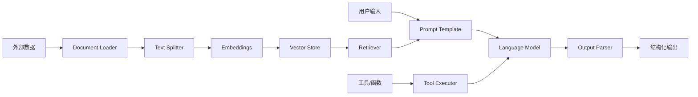
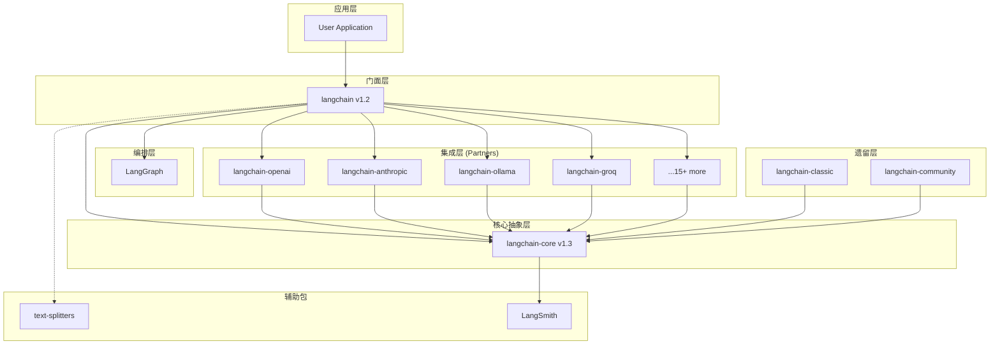
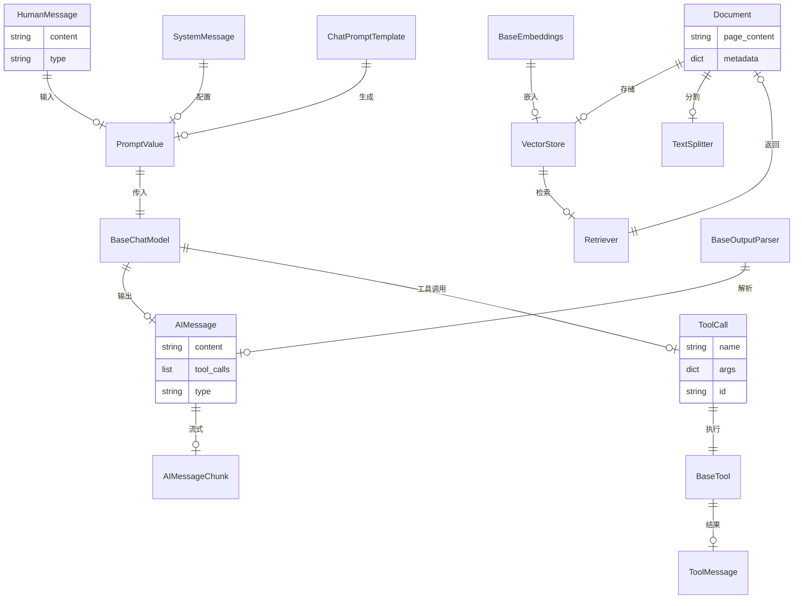
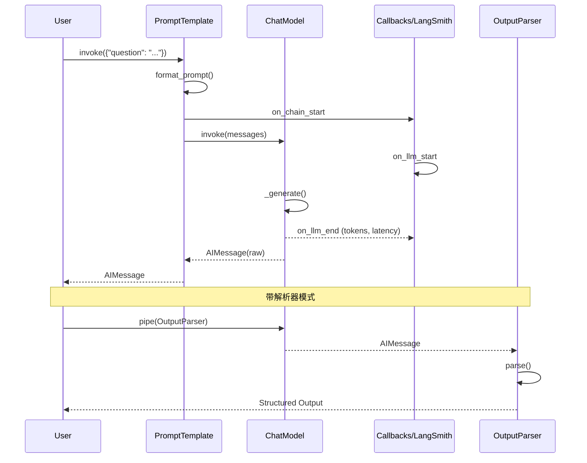

# LangChain 完整深度研究报告

> **目标仓库：** [langchain-ai/langchain](https://github.com/langchain-ai/langchain)  
> **研究日期：** 2026-04-24  
> **版本：** langchain v1.2.15 / langchain-core v1.3.1  
> **研究者水平：** INTERMEDIATE | **目标：** DEEP_UNDERSTAND

---

## 执行摘要

LangChain 是目前最流行的 LLM 应用开发框架（GitHub ⭐134,659），采用 **Monorepo + 分层架构**设计，将核心抽象层（`langchain-core`）与集成层（`langchain-classic`/partners）彻底解耦。框架以 **Runnable** 为统一执行协议，通过链式组合（LCEL）将 LLM、提示模板、工具、检索器等组件编排为复杂工作流。当前版本处于 v1.x 稳定期，Agent 编排能力已迁移至独立项目 LangGraph。

**技术评分：** ⭐⭐⭐⭐½ (4.5/5)

---

## Part 1: 项目概述

### Project Identity & Purpose

| 维度 | 值 |
|------|-----|
| 名称 | LangChain |
| 定位 | Agent 工程平台 / LLM 应用开发框架 |
| 目标用户 | AI 应用开发者、数据科学家、LLM 工程师 |
| 许可证 | MIT |
| 主要语言 | Python (3.10–3.14) |
| Stars | 134,659 |
| Forks | 22,255 |
| Open Issues | 547 |
| 创建时间 | 2022-10-17 |
| 最后推送 | 2026-04-23 |
| 成熟度 | Production/Stable (v1.2.15) |

### Technology Stack Fingerprint

| 类别 | 技术 |
|------|------|
| 语言 | Python ≥3.10 |
| 数据验证 | Pydantic v2 |
| 构建系统 | Hatchling |
| 包管理 | uv (lockfile) |
| 代码质量 | Ruff (lint), mypy (类型检查) |
| 测试 | pytest |
| CI/CD | GitHub Actions |
| 容器化 | Docker (dev.Dockerfile, devcontainer) |
| 序列化 | JSON + YAML + PyYAML |
| 可观测性 | LangSmith (内置集成) |
| 重试机制 | tenacity |
| HTTP | requests (间接) |

核心依赖极简（`libs/core/pyproject.toml`）：
```
langsmith, tenacity, jsonpatch, PyYAML, typing-extensions, packaging, pydantic, uuid-utils
```

### High-Level Architecture

```
┌─────────────────────────────────────────────────────────┐
│                    用户应用 (User App)                    │
├─────────────────────────────────────────────────────────┤
│  langchain v1.2 (轻量门面)                               │
│  ┌──────────┐ ┌──────────┐ ┌──────────┐ ┌──────────┐  │
│  │chat_models│ │embeddings│ │  tools   │ │  agents  │  │
│  └────┬─────┘ └────┬─────┘ └────┬─────┘ └────┬─────┘  │
│       │            │            │            │          │
├───────┴────────────┴────────────┴────────────┴──────────┤
│              langchain-core v1.3 (核心抽象层)              │
│  ┌─────────────────────────────────────────────────┐   │
│  │                  Runnable Protocol               │   │
│  │  ┌─────────┐ ┌─────────┐ ┌─────────┐ ┌───────┐ │   │
│  │  │BaseChat │ │BaseLLM  │ │BaseTool │ │Retriev│ │   │
│  │  │Model    │ │         │ │         │ │er     │ │   │
│  │  └────┬────┘ └────┬────┘ └────┬────┘ └───┬───┘ │   │
│  │       └───────────┴───────────┴───────────┘     │   │
│  │              Messages / Prompts / OutputParsers  │   │
│  └─────────────────────────────────────────────────┘   │
├─────────────────────────────────────────────────────────┤
│  集成层 (Partners / Classic)                             │
│  ┌─────┐ ┌──────────┐ ┌──────────┐ ┌─────┐ ┌──────┐   │
│  │OpenAI│ │Anthropic │ │Ollama    │ │Groq │ │...18+│   │
│  └─────┘ └──────────┘ └──────────┘ └─────┘ └──────┘   │
├─────────────────────────────────────────────────────────┤
│  langgraph (Agent 编排) | LangSmith (可观测性)           │
└─────────────────────────────────────────────────────────┘
```

### Repository Structure Map

```
langchain/
├── libs/
│   ├── core/                          # 🔷 核心抽象层 (无第三方依赖)
│   │   ├── langchain_core/            #   runnables, language_models, tools,
│   │   │                               #   messages, prompts, output_parsers,
│   │   │                               #   retrievers, vectorstores, embeddings
│   │   ├── tests/
│   │   └── pyproject.toml             #   v1.3.1
│   │
│   ├── langchain_v1/                  # 🟢 新版 langchain 包 (轻量门面)
│   │   ├── langchain/                 #   agents, chat_models, embeddings,
│   │   │                               #   messages, tools, rate_limiters
│   │   └── pyproject.toml             #   v1.2.15 (依赖 langgraph>=1.1.5)
│   │
│   ├── langchain/                     # 🟡 langchain-classic (遗留兼容)
│   │   ├── langchain_classic/         #   chains, agents, llms, chat_models,
│   │   │                               #   vectorstores, memory, utilities
│   │   └── pyproject.toml
│   │
│   ├── partners/                      # 🔵 模型提供商集成包
│   │   ├── openai/langchain_openai/
│   │   ├── anthropic/langchain_anthropic/
│   │   ├── groq/, ollama/, xai/, deepseek/, fireworks/,
│   │   │   mistralai/, huggingface/, perplexity/, openrouter/
│   │   │   chroma/, qdrant/, exa/, nomic/ ...
│   │   └── (17+ partner packages)
│   │
│   ├── text-splitters/                # 📄 文本分割工具
│   │   └── langchain_text_splitters/
│   │
│   ├── standard-tests/                # 🧪 标准测试套件
│   │   └── langchain_tests/
│   │
│   └── model-profiles/                # 📋 模型配置档案
│
├── .github/workflows/                 # CI/CD (17 个 workflow)
├── .devcontainer/                     # VS Code 远程开发配置
├── LICENSE                            # MIT
└── README.md
```

### Core Modules & Components

| 模块 | 路径 | 职责 |
|------|------|------|
| **Runnable** | `libs/core/langchain_core/runnables/base.py` (6261行) | 统一执行协议，所有组件的基类。支持 sync/async、streaming、batch、链式组合 |
| **Language Models** | `libs/core/langchain_core/language_models/` | LLM 和 ChatModel 的抽象基类 (`BaseLanguageModel`, `BaseChatModel`, `BaseLLM`) |
| **Tools** | `libs/core/langchain_core/tools/base.py` | 工具抽象，支持函数→工具转换、结构化输入/输出 |
| **Messages** | `libs/core/langchain_core/messages/` | 消息类型：HumanMessage, AIMessage, SystemMessage, ToolMessage |
| **Prompts** | `libs/core/langchain_core/prompts/` | 提示模板：ChatPromptTemplate, PromptTemplate, FewShotPromptTemplate |
| **Output Parsers** | `libs/core/langchain_core/output_parsers/` | 输出解析器：JSON, Pydantic, XML, String, List |
| **Retrievers** | `libs/core/langchain_core/retrievers.py` | 检索器抽象基类 |
| **Vector Stores** | `libs/core/langchain_core/vectorstores/` | 向量存储抽象 + InMemory 实现 |
| **Callbacks** | `libs/core/langchain_core/callbacks/` | 回调系统，用于日志、追踪、监控 |
| **Rate Limiters** | `libs/core/langchain_core/rate_limiters.py` | API 速率限制器 |
| **Chat Models (V1)** | `libs/langchain_v1/langchain/chat_models/base.py` | `init_chat_model()` 工厂函数，注册 27+ 提供商 |

### Data Flow Overview



### External Integrations & Dependencies

**模型提供商 (27+ registered):** OpenAI, Anthropic, Google (Vertex AI/GenAI), Azure OpenAI, AWS Bedrock, Ollama, Groq, Mistral, DeepSeek, xAI, Together, Fireworks, Perplexity, HuggingFace, Cohere, OpenRouter, Baseten, IBM Watson, LiteLLM, Upstage, NVIDIA 等。

**向量数据库:** Chroma, Qdrant (partner packages 内置)

**可观测性:** LangSmith (核心依赖)

**Agent 编排:** LangGraph (v1.x 必选依赖)

### TL;DR

1. **LangChain 是 LLM 应用的事实标准框架**，134K+ stars，MIT 协议，v1.x 生产稳定
2. **Monorepo 架构**：core（零第三方依赖抽象层）→ v1（轻量门面+LangGraph）→ classic（遗留）→ partners（集成包）
3. **Runnable 是一切的基础**：统一的 LCEL (LangChain Expression Language) 执行协议，支持链式组合、streaming、batch、fallback
4. **Agent 编排已迁移到 LangGraph**，LangChain 本身专注于模型接口标准化和组件组合
5. **`init_chat_model("openai:gpt-5.4")`** 一行代码切换 27+ 模型提供商，体现框架核心价值：模型互操作性

---

## Part 2: 架构深度分析

### Architecture Pattern Analysis

**模式：分层抽象 + 插件化集成 + 统一执行协议**

| 模式 | 证据 | 说明 |
|------|------|------|
| **分层架构** | `libs/core/` → `libs/langchain_v1/` → `libs/partners/` | 三层解耦：抽象→门面→集成 |
| **协议/接口模式** | `libs/core/langchain_core/runnables/base.py` | Runnable ABC 定义统一执行协议 |
| **工厂模式** | `libs/langchain_v1/langchain/chat_models/base.py:175` | `init_chat_model()` 动态注册/实例化提供商 |
| **策略模式** | `libs/core/langchain_core/language_models/` | BaseChatModel 可被任意提供商实现替换 |
| **装饰器/包装器** | `libs/core/langchain_core/runnables/` (retry, fallback, branch, router) | 通过 Runnable 装饰增强行为 |
| **Monorepo** | 顶层 `libs/` 目录 | 多包共享仓库，各自独立版本 |

### Module Dependency Graph



### Layer Analysis

| 层级 | 包名 | 依赖数 | 职责 | 是否含第三方 |
|------|------|--------|------|-------------|
| **L0 核心** | langchain-core | 8 (pydantic, langsmith, tenacity...) | 定义所有抽象接口、Runnable协议、消息类型 | ❌ 零第三方 |
| **L1 门面** | langchain v1 | 2 (core, langgraph) | init_chat_model 工厂、高级工具/Agent封装 | ❌ 仅核心 |
| **L1.5 文本** | text-splitters | 0-2 | 文本分割策略 | ❌ 可选 |
| **L2 集成** | partners/* | 各异 | 各模型/向量库提供商的具体实现 | ✅ 各有SDK |
| **L2 遗留** | langchain-classic | 10+ | 旧版 chains/agents/vectorstores | ✅ 大量 |
| **L3 编排** | langgraph | 独立 | 有状态 Agent 工作流 | ✅ 独立框架 |
| **L3 可观测** | langsmith | 独立 | 追踪、评估、调试 | ✅ 独立服务 |

### Interface Contracts

**核心公共 API (Runnable Protocol):**
```python
# libs/core/langchain_core/runnables/base.py
class Runnable(Generic[Input, Output]):
    def invoke(self, input: Input, config: RunnableConfig | None = None) -> Output
    async def ainvoke(self, input: Input, config: RunnableConfig | None = None) -> Output
    def stream(self, input: Input, config: RunnableConfig | None = None) -> Iterator[Output]
    async def astream(self, input: Input, config: RunnableConfig | None = None) -> AsyncIterator[Output]
    def batch(self, inputs: list[Input], config: RunnableConfig | None = None) -> list[Output]
    def transform(self, input: Iterator[Input]) -> Iterator[Output]
```

**模型接口:**
```python
# libs/core/langchain_core/language_models/chat_models.py
class BaseChatModel(BaseLanguageModel[str, BaseMessage], RunnableSerializable):
    def invoke(self, input: LanguageModelInput, config: ...): ...
    def stream(self, input: LanguageModelInput, config: ...): ...
    async def ainvoke(self, input: LanguageModelInput, config: ...): ...
```

**工具接口:**
```python
# libs/core/langchain_core/tools/base.py
class BaseTool(RunnableSerializable[str, Any]):
    name: str
    description: str
    args_schema: type[BaseModel]
    def _run(self, *args, **kwargs): ...
```

**依赖注入:** 通过 `RunnableConfig` 传递 callbacks、metadata、tags，不使用传统 DI 容器。

### Scalability & Extension Points

| 扩展点 | 方式 | 难度 |
|--------|------|------|
| 新模型提供商 | 继承 `BaseChatModel`/`BaseLLM`，注册到 `_BUILTIN_PROVIDERS` | ⭐⭐ 中等 |
| 新向量库 | 继承 `VectorStore`，实现 `add_documents`/`similarity_search` | ⭐⭐ 中等 |
| 新工具 | 继承 `BaseTool` 或用 `@tool` 装饰器 | ⭐ 简单 |
| 新输出解析器 | 继承 `BaseOutputParser` | ⭐ 简单 |
| 新 Runnable 行为 | 继承 `Runnable` 或组合现有 Runnable | ⭐⭐ 中等 |
| 自定义回调 | 实现 `BaseCallbackHandler` | ⭐ 简单 |

---

## Part 3: 功能与逻辑分析

### Feature Inventory

| # | 功能 | 模块 | 类型 |
|---|------|------|------|
| 1 | 统一模型接口 | `langchain_core.language_models` | 核心 |
| 2 | LCEL 链式组合 | `langchain_core.runnables` | 核心 |
| 3 | 提示模板管理 | `langchain_core.prompts` | 核心 |
| 4 | 工具定义与执行 | `langchain_core.tools` | 核心 |
| 5 | 输出解析 | `langchain_core.output_parsers` | 核心 |
| 6 | 消息系统 | `langchain_core.messages` | 核心 |
| 7 | 向量存储抽象 | `langchain_core.vectorstores` | 核心 |
| 8 | 检索器抽象 | `langchain_core.retrievers` | 核心 |
| 9 | 文本分割 | `langchain_text_splitters` | 工具 |
| 10 | 模型工厂 | `langchain.chat_models.init_chat_model` | 门面 |
| 11 | 速率限制 | `langchain_core.rate_limiters` | 运维 |
| 12 | 回调/追踪系统 | `langchain_core.callbacks` | 可观测 |
| 13 | 缓存 | `langchain_core.caches` | 性能 |
| 14 | Agent 动作定义 | `langchain_core.agents` | 遗留 |
| 15 | 嵌入模型接口 | `langchain_core.embeddings` | 核心 |
| 16 | 跨编码器接口 | `langchain_core.cross_encoders` | 核心 |
| 17 | 文档加载器 | `langchain_classic.document_loaders` | 遗留/扩展 |
| 18 | RAG 链 | `langchain_classic.chains.retrieval_qa` | 遗留 |
| 19 | Agent 编排 | LangGraph (外部依赖) | 编排 |
| 20 | 图可视化 | `langchain_core.runnables.graph_*` | 调试 |

### Top 5 Core Features Deep Dive

#### Feature 1: Runnable 统一执行协议

**入口点：** `libs/core/langchain_core/runnables/base.py`

**核心设计：** 6261 行的 `Runnable` 类是整个框架的基础。它定义了统一的调用接口 (`invoke`, `ainvoke`, `stream`, `astream`, `batch`)，并支持 **管道操作符** (`|`) 进行链式组合。

**关键代码片段：**
```python
# libs/core/langchain_core/runnables/base.py
class Runnable(Generic[Input, Output], ABC):
    @abstractmethod
    def invoke(self, input: Input, config: Optional[RunnableConfig] = None) -> Output:
        ...
    
    def __or__(self, other: Runnable) -> RunnableSequence:
        """Chain two Runnables together using | operator."""
        return RunnableSequence(self, other)
    
    def pipe(self, *others: Runnable) -> RunnableSequence:
        return RunnableSequence(self, *others)
```

**调用链：** `user.invoke("hello")` → `Runnable.invoke()` → `RunnableConfig` 处理 → 回调管理 → 实际执行 (`_invoke`) → 后处理 → 返回

#### Feature 2: 模型互操作性 (init_chat_model)

**入口点：** `libs/langchain_v1/langchain/chat_models/base.py:175`

**关键代码：**
```python
_BUILTIN_PROVIDERS: dict[str, tuple[str, str, Callable]] = {
    "openai": ("langchain_openai", "ChatOpenAI", _call),
    "anthropic": ("langchain_anthropic", "ChatAnthropic", _call),
    "ollama": ("langchain_ollama", "ChatOllama", _call),
    # ... 27+ providers
}

def init_chat_model(model: str, *, model_provider: str | None = None, ...):
    """Initialize a chat model from a string like 'openai:gpt-5.4'."""
```

**调用链：** `init_chat_model("openai:gpt-5.4")` → 解析 provider+model → 查 `_BUILTIN_PROVIDERS` → `importlib.import_module` → 实例化 → 返回 `BaseChatModel`

#### Feature 3: 提示模板系统

**入口点：** `libs/core/langchain_core/prompts/chat.py`

支持 ChatPromptTemplate、PromptTemplate、FewShotPromptTemplate 等，通过 `|` 管道直接连接到模型。

#### Feature 4: 工具系统

**入口点：** `libs/core/langchain_core/tools/base.py`

支持将 Python 函数自动转换为 LLM 工具（`@tool` 装饰器），自动从类型注解推断 JSON Schema，支持 Pydantic v1/v2。

#### Feature 5: 文本分割

**入口点：** `libs/text-splitters/langchain_text_splitters/`

提供 15+ 分割策略：字符分割、递归字符分割、Markdown/HTML/LaTeX/JSON 语义分割、NLTK/SpaCy 分句、代码分割等。

### Cross-Cutting Concerns

| 关注点 | 实现方式 | 位置 |
|--------|---------|------|
| **日志** | Python `logging` + LangSmith 追踪 | `callbacks/` |
| **错误处理** | tenacity 重试 + Runnable fallback | `runnables/retry.py`, `runnables/fallbacks.py` |
| **认证** | 环境变量 (`from_env`) + 模型参数 | 各 partner 包 |
| **配置** | `RunnableConfig` (metadata/tags/callbacks) | `runnables/config.py` |
| **缓存** | `BaseCache` 接口 + InMemory/Redis 实现 | `caches.py` |
| **输入验证** | Pydantic 模型验证 | 全局 |
| **速率限制** | `BaseRateLimiter` | `rate_limiters.py` |
| **序列化** | `Serializable` (JSON 安全序列化) | `load/serializable.py` |

### Test Coverage

- 测试文件数：538 个 (`test_*.py` / `*_test.py`)
- Python 文件总数：2,461
- 总代码行数：344,694
- 标准测试套件：`libs/standard-tests/langchain_tests/` (为所有集成包提供通用测试)
- CI: 17 个 GitHub Actions workflows，包括 lint、type check、单元测试、集成测试、VCR 测试

---

## Part 4: 数据流分析

### Data Model Analysis



### Request/Response Lifecycle



### State Management Analysis

LangChain 本身是**无状态**的——每个 `invoke()` 调用独立。状态管理通过以下方式实现：

1. **Chat History（外部）**: `langchain_core.chat_history.py` — 历史消息由应用层维护
2. **RunnableConfig**: 每次调用传入，包含 callbacks、metadata、tags，不持久化
3. **LangGraph（推荐）**: 提供有状态图执行，支持 checkpoint 持久化
4. **VectorStore**: 持久化存储文档嵌入，作为 RAG 的"长期记忆"

### Persistence Layer

| 持久化类型 | 实现 | 位置 |
|-----------|------|------|
| 向量存储 | InMemory, Chroma, Qdrant (partner) | `libs/core/langchain_core/vectorstores/in_memory.py` |
| 缓存 | InMemoryCache, RedisCache (langchain-community) | `libs/core/langchain_core/caches.py` |
| 文档存储 | InMemoryDocstore | `libs/langchain/langchain_classic/docstore/` |
| 对话历史 | 应用层管理 | `libs/core/langchain_core/chat_history.py` |
| Agent 状态 | LangGraph checkpoint | 外部依赖 |

### Data Security & Privacy

- `_security/` 目录存在于 core 中，提供安全工具
- API Key 通过环境变量管理 (`from_env()`)
- 不在框架层记录用户数据（通过 LangSmith 可控）
- 支持 opaqueprompts 集成（classic 遗留）
- 无内置 PII 过滤——安全责任在应用层

---

## Part 5: Agent 编排分析

### Bootstrap

LangChain v1 的 Agent 编排**已迁移至 LangGraph**。`langchain-core` 中的 `agents.py` 仅保留 schema 定义（`AgentAction`, `AgentFinish`），并明确标注向后兼容。

### Architecture Discovery

```python
# libs/core/langchain_core/agents.py (顶部警告)
"""!!! warning: New agents should be built using the langchain library,
which provides a simpler and more flexible way to define agents.
See docs on building agents."""
```

LangChain v1 的 `libs/langchain_v1/langchain/agents/` 依赖 `langgraph>=1.1.5`，说明 Agent 工作流现在由 LangGraph 驱动。

### Feature Mapping → Data Flow → Deployment → Synthesis

**当前 Agent 架构路径：**
```
langchain (v1 门面) → langgraph (状态图编排) → langchain-core (模型/工具接口)
                     ↑
              LangSmith (追踪/调试)
```

### Synthesis

| 维度 | LangChain 的角色 | LangGraph 的角色 |
|------|----------------|-----------------|
| 模型接口 | ✅ 统一 | ❌ |
| 工具定义 | ✅ BaseTool | ❌ |
| 简单链式调用 | ✅ LCEL | 过度 |
| 有状态 Agent | ❌ | ✅ StateGraph |
| 条件分支/循环 | ❌ | ✅ |
| Checkpoint 持久化 | ❌ | ✅ |
| 人机交互 (interrupt) | ❌ | ✅ |

**结论：** LangChain 已从"全包"框架转型为**模型互操作性层**，Agent 编排的复杂度由 LangGraph 承担。

---

## Part 6: 技术评估

### Technology Choices Evaluation

| 选型 | 评分 | 理由 |
|------|------|------|
| Pydantic v2 | ⭐⭐⭐⭐⭐ | 类型安全、自动验证、JSON Schema 生成，LLM 工具定义天然适配 |
| Hatchling | ⭐⭐⭐⭐ | 轻量、快速，适合纯 Python 项目 |
| uv | ⭐⭐⭐⭐⭐ | 极速包管理，lockfile 保证可复现 |
| Ruff | ⭐⭐⭐⭐⭐ | Rust 实现，替代 flake8+isort+black |
| LangSmith | ⭐⭐⭐⭐ | 深度集成但有商业锁定风险 |
| Monorepo | ⭐⭐⭐ | 代码组织清晰但仓库体积大 (34万行) |

### Engineering Practices Scorecard

| 维度 | 评分 | 说明 |
|------|------|------|
| 代码质量 | ✅ | 类型注解完整、Ruff lint、mypy 检查、Pydantic 验证 |
| DevOps/CI | ✅ | 17 个 GitHub Actions workflows、自动标签、集成测试 |
| 安全 | ⚠️ | `_security/` 存在但无纵深防御；API Key 通过环境变量 |
| 文档 | ✅ | docs.langchain.com + API reference + README |
| 社区 | ✅ | 134K stars、活跃贡献、LangChain Academy、Forum |
| 测试 | ✅ | 538 测试文件、标准测试套件、VCR 测试 |
| 架构演进 | ⚠️ | classic→v1 迁移进行中，存在遗留代码 |
| 依赖管理 | ✅ | uv lockfile、core 零第三方、清晰分层 |

### Comparative Analysis

| 维度 | LangChain | LlamaIndex | Semantic Kernel | CrewAI |
|------|-----------|------------|-----------------|--------|
| 定位 | 通用 LLM 框架 | RAG 专精 | 企业级 (.NET/Python) | 多 Agent 协作 |
| 模型支持 | 27+ | 25+ | Azure/OpenAI 为主 | 多模型 |
| Agent 编排 | LangGraph | 内置 | Planner | 内置 |
| RAG | 支持 | ⭐ 核心优势 | 支持 | 基础 |
| 成熟度 | ⭐⭐⭐⭐⭐ | ⭐⭐⭐⭐ | ⭐⭐⭐⭐ | ⭐⭐⭐ |
| 学习曲线 | 中等 | 中等 | 较陡 | 简单 |

### Red Flags & Highlights

**🚩 Red Flags:**
1. **classic 遗留包** — `langchain_classic` 含 80+ LLM 集成（大多已迁移到 partners），增加仓库体积和维护负担
2. **LangSmith 商业锁定** — 可观测性深度绑定 LangSmith，虽开源但核心服务商业化
3. **快速迭代 breaking changes** — v0→v1 有大量 API 变更，迁移成本高
4. **无内置 PII 保护** — 安全责任完全在应用层

**🌟 Highlights:**
1. **核心层极简依赖** — langchain-core 仅 8 个依赖，零第三方
2. **LCEL 管道语法** — `prompt | model | parser` 优雅且强大
3. **模型工厂** — `init_chat_model()` 一行切换提供商
4. **标准测试套件** — `langchain_tests` 为所有 partner 包提供通用测试
5. **清晰分层** — core/v1/classic/partners 四层解耦

---

## Part 7: 部署分析

### Environment Requirements

| 要求 | 最低 | 推荐 |
|------|------|------|
| Python | 3.10 | 3.11–3.13 |
| OS | Linux/macOS/Windows | Linux |
| 内存 | 256MB (框架本身) | 2GB+ (含模型) |
| 磁盘 | ~100MB (框架) | 10GB+ (含向量库) |

### Deployment Methods

**本地开发：**
```bash
# 方式 1：pip install
pip install langchain langchain-openai

# 方式 2：uv
uv add langchain langchain-openai

# 方式 3：devcontainer
# 使用 .devcontainer/ 配置自动创建开发环境
```

**Docker 开发环境：**
```dockerfile
# libs/langchain/dev.Dockerfile
FROM python:3.11-slim-bookworm
# 安装 uv、系统依赖、项目代码
# 支持非 root 用户运行
```

**生产部署：** LangChain 本身是库，不单独部署。通常作为应用的一部分：
- 嵌入 FastAPI/Flask 后端
- 使用 LangSmith Deployment 平台
- 容器化后部署到 K8s

### Configuration Reference

```python
# 环境变量（各 partner 包通用）
OPENAI_API_KEY=sk-...
ANTHROPIC_API_KEY=sk-ant-...
LANGCHAIN_TRACING_V2=true       # 启用 LangSmith 追踪
LANGCHAIN_API_KEY=ls__...        # LangSmith API Key
LANGCHAIN_PROJECT=my-project     # 项目名

# RunnableConfig
config = {
    "callbacks": [my_handler],
    "tags": ["production", "v2"],
    "metadata": {"user_id": "123"},
    "max_concurrency": 5,
}
```

### Upgrade & Migration Path

| 版本 | 状态 | 迁移指南 |
|------|------|---------|
| v0.x | ❌ 已废弃 | → v1.x |
| langchain-classic | ⚠️ 遗留兼容 | → langchain v1 + partners |
| langchain-community | ⚠️ 独立维护 | → 各 partner 包 |
| v1.x | ✅ 当前稳定 | — |

---

## Part 8: 学习路径

### Prerequisite Knowledge Map

```
Python 基础
├── 类型注解 (Type Hints)
├── 异步编程 (async/await)
├── 装饰器
└── Pydantic 数据模型

LLM 基础
├── Prompt Engineering
├── Token / Context Window
├── Temperature / Sampling
└── Function Calling / Tool Use

AI 应用模式
├── RAG (Retrieval Augmented Generation)
├── Agent / ReAct 模式
└── Chain-of-Thought
```

### Phased Learning Roadmap

#### 阶段 1: Orientation（1-2 天）

1. **安装与 Quickstart**
   ```bash
   pip install langchain langchain-openai
   python -c "from langchain.chat_models import init_chat_model; m = init_chat_model('openai:gpt-4o-mini'); print(m.invoke('hello'))"
   ```

2. **核心概念理解**
   - 阅读 `libs/core/langchain_core/runnables/base.py` 的类定义
   - 理解 Message 类型 (`libs/core/langchain_core/messages/`)
   - 运行 Prompt + Model + Parser 管道

3. **推荐资源**
   - [docs.langchain.com](https://docs.langchain.com)
   - [LangChain Academy](https://academy.langchain.com/) (免费课程)

#### 阶段 2: Core Concepts（1-2 周）

1. **LCEL 深入** — 理解 Runnable 协议、管道组合、streaming
2. **工具系统** — 用 `@tool` 创建工具、绑定到模型
3. **RAG 流水线** — Document Loader → Text Splitter → Embeddings → Vector Store → Retriever
4. **输出解析** — JSON/Pydantic 结构化输出
5. **多模型切换** — `init_chat_model()` 工厂模式

#### 阶段 3: Deep Mastery（2-4 周）

1. **LangGraph Agent** — 有状态图、条件分支、checkpoint
2. **自定义 Callback** — 追踪、日志、评估
3. **自定义集成** — 继承 BaseChatModel/BaseTool
4. **生产最佳实践** — 速率限制、缓存、错误处理、LangSmith
5. **阅读源码** — `runnables/base.py` (6261行) 是必读经典

### Quick Reference Card

```python
# 模型初始化
from langchain.chat_models import init_chat_model
model = init_chat_model("openai:gpt-4o-mini")  # 或 "ollama:llama3"

# LCEL 管道
from langchain_core.prompts import ChatPromptTemplate
from langchain_core.output_parsers import StrOutputParser

chain = ChatPromptTemplate.from_template("Tell me about {topic}") | model | StrOutputParser()
result = chain.invoke({"topic": "LangChain"})

# 工具
from langchain_core.tools import tool
@tool
def search(query: str) -> str:
    """Search the web."""
    return f"Results for: {query}"

model_with_tools = model.bind_tools([search])

# RAG
from langchain_core.vectorstores import InMemoryVectorStore
from langchain_openai import OpenAIEmbeddings
vectorstore = InMemoryVectorStore.from_texts(docs, OpenAIEmbeddings())
retriever = vectorstore.as_retriever()
rag_chain = {"context": retriever, "question": RunnablePassthrough()} | prompt | model
```

### Community & Ecosystem

| 资源 | 链接 |
|------|------|
| 官方文档 | https://docs.langchain.com |
| API Reference | https://reference.langchain.com/python |
| LangChain Forum | https://forum.langchain.com |
| LangChain Academy | https://academy.langchain.com |
| Chat LangChain | https://chat.langchain.com |
| Discord | https://www.langchain.com/join-community |
| Twitter/X | @LangChain |
| Reddit | r/LangChain |
| LangGraph | https://github.com/langchain-ai/langgraph |
| LangSmith | https://smith.langchain.com |

---

## Part 9: 最终报告总结

### 技术评分

| 维度 | 评分 (1-5) | 说明 |
|------|-----------|------|
| 代码质量 | 4.5 | 类型完整、分层清晰、lint 严格 |
| 架构设计 | 4.5 | Runnable 统一协议、插件化集成 |
| 可扩展性 | 5.0 | 新提供商/工具/解析器极易添加 |
| 文档 | 4.0 | 官方文档完善，源码 docstring 充分 |
| 社区活跃度 | 5.0 | 134K stars、538 测试、17 CI workflows |
| 安全性 | 3.0 | 基础安全措施，无纵深防御 |
| 生产就绪度 | 4.0 | v1.x 稳定，LangSmith 支撑 |
| 学习曲线 | 3.5 | 中等偏上，概念较多 |
| **综合评分** | **4.5** | |

### 核心发现

1. **LangChain 是 LLM 应用的事实标准**，其核心价值在于**模型互操作性**（27+ 提供商统一接口）和 **LCEL 声明式编排**
2. **架构演进方向明确**：从全包框架 → 核心抽象层 + 独立编排 (LangGraph) + 模块化集成 (partners)
3. **`Runnable` 是最核心的抽象**（6261 行），理解它等于理解了整个框架
4. **当前处于 v1.x 稳定期**，classic 遗留代码正在逐步清理，新项目应直接使用 v1 + partners
5. **LangSmith 是双刃剑**——提供出色的可观测性，但存在商业锁定风险

### 关键文件索引

| 文件 | 重要性 | 描述 |
|------|--------|------|
| `libs/core/langchain_core/runnables/base.py` | ⭐⭐⭐⭐⭐ | Runnable 统一执行协议 |
| `libs/core/langchain_core/language_models/chat_models.py` | ⭐⭐⭐⭐⭐ | ChatModel 抽象基类 |
| `libs/core/langchain_core/tools/base.py` | ⭐⭐⭐⭐⭐ | 工具系统 |
| `libs/core/langchain_core/messages/` | ⭐⭐⭐⭐ | 消息类型系统 |
| `libs/core/langchain_core/prompts/` | ⭐⭐⭐⭐ | 提示模板 |
| `libs/langchain_v1/langchain/chat_models/base.py` | ⭐⭐⭐⭐ | 模型工厂 (init_chat_model) |
| `libs/core/langchain_core/output_parsers/` | ⭐⭐⭐ | 输出解析器 |
| `libs/core/langchain_core/vectorstores/base.py` | ⭐⭐⭐ | 向量存储抽象 |

---

*报告生成时间：2026-04-24 | 基于 langchain v1.2.15 / langchain-core v1.3.1 源码分析*
