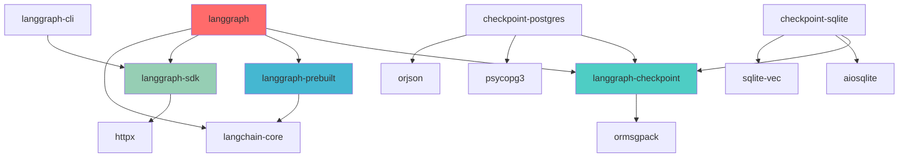
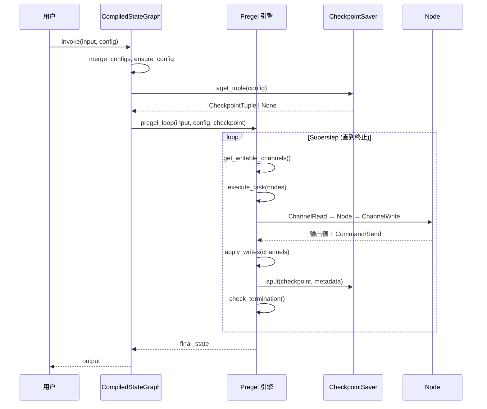
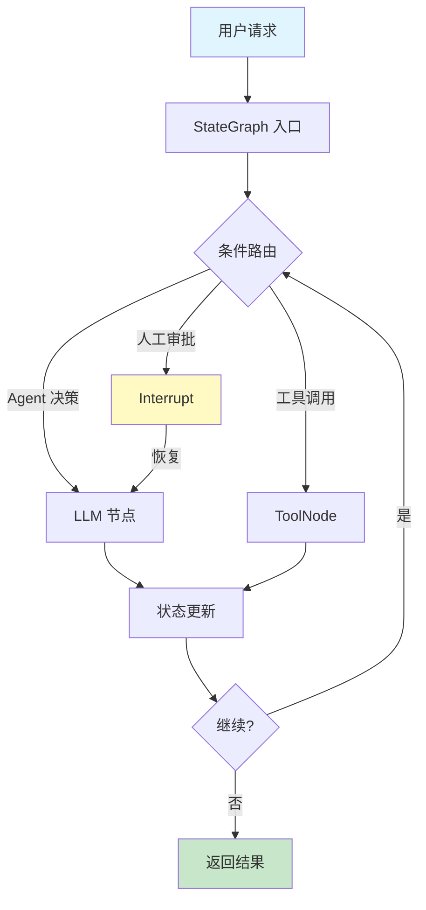
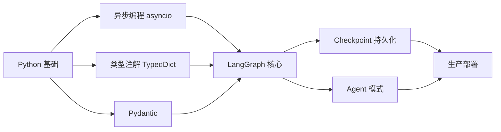

# LangGraph 完整深度研究报告

> **研究日期：** 2026-04-24  
> **目标仓库：** [langchain-ai/langgraph](https://github.com/langchain-ai/langgraph)  
> **代码版本：** langgraph v1.1.9 / checkpoint v4.0.2  
> **研究者水平：** INTERMEDIATE | **目标：** DEEP_UNDERSTAND

---

## 第一部分：项目概述

### 1.1 Project Identity & Purpose

| 属性 | 值 |
|------|------|
| **项目名称** | LangGraph |
| **定位** | 低层级有状态 Agent 编排框架 |
| **开发方** | LangChain Inc |
| **许可证** | MIT |
| **语言** | Python（主） + TypeScript/JavaScript（SDK） |
| **成熟度** | Production/Stable（PyPI 分类 5） |
| **当前版本** | langgraph 1.1.9 |

**核心价值主张：** 为构建长时间运行、有状态的工作流/Agent 提供底层编排基础设施，支持持久化执行、人机协作、综合记忆和调试。

**目标用户：**
- 构建复杂 AI Agent 的开发者
- 需要多步骤工作流编排的团队
- 需要状态持久化和恢复能力的生产环境

### 1.2 Technology Stack Fingerprint

| 组件 | 技术 |
|------|------|
| **主语言** | Python ≥3.10 |
| **构建系统** | Hatchling |
| **包管理** | uv（开发） / pip（发布） |
| **核心依赖** | langchain-core, pydantic ≥2.7.4, xxhash, ormsgpack |
| **类型系统** | typing_extensions TypedDict + Pydantic v2 |
| **序列化** | ormsgpack, orjson, JSON+ |
| **数据库** | PostgreSQL（psycopg3）, SQLite（aiosqlite + sqlite-vec） |
| **缓存** | Redis |
| **CLI** | Click |
| **HTTP** | httpx |
| **加密** | pycryptodome |
| **测试** | pytest + pytest-asyncio + syrupy（快照） + pytest-xdist |
| **Lint** | ruff + mypy（严格模式） |
| **JS SDK** | TypeScript（libs/sdk-js） |

### 1.3 High-Level Architecture

LangGraph 采用 **Monorepo + 多包架构**，核心是 Pregel 计算模型：

```
┌─────────────────────────────────────────────────────────┐
│                    LangGraph 生态                        │
├─────────────┬──────────────┬──────────────┬─────────────┤
│   langgraph │  checkpoint  │   prebuilt   │   sdk-py    │
│  (核心引擎)  │  (状态持久化)  │  (预置组件)   │  (远程SDK)  │
├─────────────┴──────────────┴──────────────┴─────────────┤
│                   Pregel 执行引擎                         │
│  ┌─────────┐   ┌──────────┐   ┌───────────┐             │
│  │ Channels │──▶│  Nodes   │──▶│  Branches │             │
│  │ (状态通道) │   │ (执行节点) │   │ (条件路由) │             │
│  └─────────┘   └──────────┘   └───────────┘             │
├─────────────────────────────────────────────────────────┤
│  Checkpoint Savers: Memory | SQLite | PostgreSQL        │
│  Store: Memory | External                                │
│  Cache: Memory | Redis                                   │
└─────────────────────────────────────────────────────────┘
```

### 1.4 Repository Structure Map

```
libs/
├── langgraph/              # 核心库 (v1.1.9)
│   └── langgraph/
│       ├── graph/          # StateGraph, MessageGraph 构建器
│       ├── pregel/         # Pregel 执行引擎（核心算法）
│       ├── channels/       # 通道类型（LastValue, Ephemeral, Topic 等）
│       ├── func/           # @task, @entrypoint 装饰器
│       ├── managed/        # 托管值（is_last_step 等）
│       ├── _internal/      # 内部工具（序列化、配置、字段处理）
│       ├── utils/          # 工具函数
│       ├── types.py        # Command, Send, Interrupt, RetryPolicy 等
│       ├── errors.py       # 错误类型定义
│       ├── constants.py    # START, END 常量
│       └── config.py       # 配置工具
├── checkpoint/             # 检查点基类 (v4.0.2)
│   └── langgraph/
│       ├── checkpoint/     # BaseCheckpointSaver, Checkpoint, CheckpointMetadata
│       │   ├── base/       # 核心接口
│       │   ├── memory/     # 内存检查点
│       │   └── serde/      # 序列化（JSON+, MsgPack, 加密）
│       ├── store/          # BaseStore（跨线程持久化存储）
│       └── cache/          # BaseCache（缓存接口）
├── checkpoint-postgres/    # PostgreSQL 检查点实现
├── checkpoint-sqlite/      # SQLite 检查点实现
├── checkpoint-conformance/ # 检查点一致性测试套件
├── prebuilt/               # 预置组件
│   └── langgraph/prebuilt/
│       ├── tool_node.py    # ToolNode 工具执行节点
│       ├── chat_agent_executor.py  # 聊天 Agent 执行器
│       ├── interrupt.py    # 中断工具
│       └── tool_validator.py
├── sdk-py/                 # Python SDK（远程调用 LangGraph Server）
├── sdk-js/                 # TypeScript SDK
├── cli/                    # langgraph CLI 工具
│   └── langgraph_cli/
├── docs/                   # 文档
└── examples/               # 示例（20个子目录）
```

### 1.5 Core Modules & Components

| 模块 | 职责 | 关键文件 | 耦合度 |
|------|------|----------|--------|
| **graph** | 图构建器（StateGraph, MessageGraph） | `graph/state.py`, `graph/message.py` | 中 - 依赖 channels, pregel |
| **pregel** | Pregel 执行引擎 | `pregel/main.py`, `pregel/_algo.py`, `pregel/_call.py` | 高 - 核心依赖 checkpoint |
| **channels** | 状态通道抽象 | `channels/base.py`, `channels/last_value.py` | 低 - 独立接口 |
| **func** | 声明式 API（@task, @entrypoint） | `func/__init__.py` | 中 - 包装 pregel |
| **checkpoint** | 检查点接口与基类 | `checkpoint/base/__init__.py` | 低 - 独立接口 |
| **prebuilt** | 预置可复用组件 | `prebuilt/tool_node.py` | 中 - 依赖 langchain-core |
| **sdk-py** | 远程 API 客户端 | `langgraph_sdk/client.py` | 低 - 独立 HTTP 客户端 |
| **cli** | 命令行工具 | `langgraph_cli/cli.py` | 中 - 依赖 sdk-py |

### 1.6 Data Flow Overview

```
用户输入 (invoke/stream)
    │
    ▼
StateGraph.compile() ──▶ CompiledStateGraph (Pregel)
    │
    ▼
Pregel 执行循环 (_algo.py)
    │
    ├─▶ 读取检查点 (Checkpoint Saver)
    ├─▶ 确定就绪节点 (superstep)
    ├─▶ 执行节点 (ChannelRead → Node → ChannelWrite)
    ├─▶ 应用 reducer 聚合通道值
    ├─▶ 保存检查点
    └─▶ 路由到下一节点 (Branch/Edge)
    │
    ▼
输出 (stream events / final state)
```

### 1.7 External Integrations & Dependencies

| 集成 | 用途 |
|------|------|
| **langchain-core** | Runnable 接口、消息类型、工具抽象 |
| **Pydantic v2** | 数据校验、序列化、Schema 生成 |
| **ormsgpack** | 高性能序列化 |
| **PostgreSQL** | 生产级检查点持久化 |
| **SQLite + sqlite-vec** | 轻量级检查点 + 向量搜索 |
| **Redis** | 分布式缓存 |
| **LangSmith** | 可观测性、调试、评估 |
| **LangGraph Platform** | 托管部署（通过 SDK/CLI） |

### TL;DR

- LangGraph 是基于 **Pregel 模型**的有状态 Agent 编排框架，灵感来自 Google Pregel 和 Apache Beam
- 核心抽象是 **StateGraph**（图构建）→ **CompiledStateGraph/Pregel**（执行引擎）→ **Checkpoint**（状态持久化）
- 采用 **Monorepo 多包**架构：核心引擎、检查点、预置组件、SDK、CLI 各自独立
- 支持 **Python + TypeScript** 双语言，提供内存/SQLite/PostgreSQL 三级持久化
- 代码量约 6 万行 Python（含测试），严格类型检查，成熟度高

---

## 第二部分：架构深度分析

### 2.1 Architecture Pattern Analysis

#### 2.1.1 Pregel 计算模型（核心架构）

LangGraph 的执行引擎基于 **Pregel 模型**——一种面向图计算的批量同步并行（BSP）模型。

**代码证据：** `libs/langgraph/langgraph/pregel/_algo.py` 实现了 superstep 概念：

```python
# _algo.py - 核心 superstep 循环
# 每个步骤：确定就绪节点 → 执行 → 写入通道 → 检查终止条件
```

`libs/langgraph/langgraph/pregel/main.py` 是 Pregel 主类，继承自 `Runnable`：

```python
class Pregel(Runnable[Input, Output], Generic[StateT, ContextT, InputT, OutputT]):
    # 实现 LangChain Runnable 接口
```

#### 2.1.2 Builder 模式（图构建）

**代码证据：** `libs/langgraph/langgraph/graph/state.py`

```python
class StateGraph(Generic[StateT, ContextT, InputT, OutputT]):
    def add_node(self, ...) -> Self: ...      # 链式调用
    def add_edge(self, ...) -> Self: ...      # 链式调用
    def add_conditional_edges(self, ...) -> Self: ...
    def compile(self, ...) -> CompiledStateGraph: ...  # 构建最终对象
```

#### 2.1.3 Channel/Actor 模型（状态管理）

**代码证据：** `libs/langgraph/langgraph/channels/` 定义了多种通道类型：

- `LastValue` - 最新值覆盖
- `EphemeralValue` - 临时值（不持久化）
- `BinaryOperatorAggregate` - 通过 reducer 函数聚合
- `Topic` - 发布/订阅模式

#### 2.1.4 Strategy 模式（序列化）

**代码证据：** `libs/checkpoint/langgraph/checkpoint/serde/`

```python
# serde/base.py - SerializerProtocol 接口
# serde/jsonplus.py - JSON+ 序列化
# serde/_msgpack.py - MsgPack 序列化
# serde/encrypted.py - 加密序列化
```

#### 2.1.5 Repository 模式（持久化）

**代码证据：** `libs/checkpoint/langgraph/checkpoint/base/__init__.py`

```python
class BaseCheckpointSaver(ABC):
    # 抽象基类，定义 put/get/list 接口
    # checkpoint-postgres 和 checkpoint-sqlite 提供具体实现
```

### 2.2 Module Dependency Graph



### 2.3 Layer Analysis

| 层 | 模块 | 职责 | 违规检查 |
|----|------|------|----------|
| **API 层** | `graph/state.py`, `func/__init__.py` | 用户面向的图构建 API | ✅ 无违规 |
| **执行层** | `pregel/` | Pregel 算法、节点调度、状态传播 | ✅ 依赖注入良好 |
| **通道层** | `channels/` | 状态通道抽象 | ✅ 接口隔离 |
| **持久化层** | `checkpoint/` | 检查点保存/恢复 | ✅ 依赖倒置 |
| **序列化层** | `checkpoint/serde/` | 数据序列化/反序列化 | ✅ 策略模式 |
| **集成层** | `prebuilt/`, `sdk-py/`, `cli/` | 预置组件、远程调用 | ✅ 可选依赖 |

### 2.4 Interface Contracts

#### 核心 API

```python
# 图构建接口
class StateGraph:
    def add_node(node, action, ...) -> Self
    def add_edge(start, end) -> Self
    def add_conditional_edges(source, path, path_map) -> Self
    def compile(checkpointer, ...) -> CompiledStateGraph

# 执行接口（继承 Runnable）
class CompiledStateGraph(Pregel):
    def invoke(input, config) -> Output
    async def ainvoke(input, config) -> Output
    def stream(input, config) -> Iterator
    async def astream(input, config) -> AsyncIterator
    def get_state(config) -> StateSnapshot
    def update_state(config, values) -> None

# 检查点接口
class BaseCheckpointSaver:
    def put(config, checkpoint, metadata, ...) -> str
    async def aput(...) -> str
    def get_tuple(config) -> CheckpointTuple | None
    def list(config, ...) -> Iterator[CheckpointTuple]
```

#### 依赖注入

- **Checkpointer** 通过 `compile(checkpointer=...)` 注入
- **Store** 通过 `compile(store=...)` 注入
- **Cache** 通过 `compile(cache=...)` 注入
- **Context** 通过 `config["configurable"]["context"]` 注入

### 2.5 Scalability & Extension Points

| 扩展点 | 实现方式 | 示例 |
|--------|----------|------|
| 自定义检查点 | 继承 `BaseCheckpointSaver` | `checkpoint-postgres`, `checkpoint-sqlite` |
| 自定义通道 | 继承 `BaseChannel` | `Annotated[list, reducer]` |
| 自定义序列化 | 实现 `SerializerProtocol` | `JsonPlusSerializer`, `EncryptedSerializer` |
| 自定义节点 | 任意 `Callable[[State], Partial[State]]` | 函数、Runnable、LangChain 组件 |
| 远程部署 | 通过 SDK + CLI | `langgraph build/deploy` |

---

## 第三部分：功能与逻辑分析

### 3.1 Feature Inventory

| # | 功能 | 模块 | 状态 |
|---|------|------|------|
| 1 | StateGraph 图构建 | `graph/state.py` | ✅ 核心 |
| 2 | MessageGraph 消息图 | `graph/message.py` | ✅ 核心 |
| 3 | Pregel 执行引擎 | `pregel/main.py` | ✅ 核心 |
| 4 | 条件路由/分支 | `graph/_branch.py` | ✅ 核心 |
| 5 | 子图（Subgraph） | `pregel/_algo.py` | ✅ 核心 |
| 6 | Send（动态任务分发） | `types.py` | ✅ 核心 |
| 7 | Command（命令式导航） | `types.py` | ✅ 核心 |
| 8 | 中断（Interrupt） | `types.py`, `prebuilt/interrupt.py` | ✅ 核心 |
| 9 | 人机协作（Human-in-the-loop） | `pregel/main.py` | ✅ 核心 |
| 10 | 检查点持久化 | `checkpoint/` | ✅ 核心 |
| 11 | 内存检查点 | `checkpoint/memory/` | ✅ |
| 12 | PostgreSQL 检查点 | `checkpoint-postgres/` | ✅ |
| 13 | SQLite 检查点 | `checkpoint-sqlite/` | ✅ |
| 14 | 加密序列化 | `checkpoint/serde/encrypted.py` | ✅ |
| 15 | Store（跨线程存储） | `store/` | ✅ |
| 16 | 缓存（Redis/Memory） | `cache/` | ✅ |
| 17 | 流式输出（多模式） | `pregel/main.py` | ✅ 核心 |
| 18 | 重试策略 | `types.py` (RetryPolicy) | ✅ |
| 19 | 缓存策略 | `types.py` (CachePolicy) | ✅ |
| 20 | @task / @entrypoint | `func/__init__.py` | ✅ |
| 21 | ToolNode | `prebuilt/tool_node.py` | ✅ |
| 22 | Chat Agent Executor | `prebuilt/chat_agent_executor.py` | ✅ |
| 23 | Managed Values | `managed/` | ✅ |
| 24 | Context Schema | `graph/state.py` | ✅ |
| 25 | Input/Output Schema | `graph/state.py` | ✅ |
| 26 | Python SDK | `sdk-py/` | ✅ |
| 27 | TypeScript SDK | `sdk-js/` | ✅ |
| 28 | CLI 工具 | `cli/` | ✅ |
| 29 | LangSmith 集成 | 回调机制 | ✅ |
| 30 | JSON Schema 生成 | `graph/state.py` | ✅ |

### 3.2 Top 5 Core Features Deep Dive

#### Feature 1: StateGraph 图构建

- **入口点：** `libs/langgraph/langgraph/graph/state.py` → `StateGraph.__init__`
- **调用链：**
  ```
  StateGraph() → add_node() → add_edge()/add_conditional_edges() → compile()
  → CompiledStateGraph.validate() → Pregel.__init__()
  ```
- **关键代码：** `compile()` 方法将 builder 转换为可执行的 `CompiledStateGraph`，注册节点触发器、通道读写器

#### Feature 2: Pregel 执行引擎

- **入口点：** `libs/langgraph/langgraph/pregel/main.py` → `Pregel.invoke()`
- **调用链：**
  ```
  Pregel.invoke() → Pregel._call() → _algo.pregel_loop()
  → superstep: get_writable_channels() → execute_node() → apply_writes()
  → save_checkpoint → check_termination
  ```
- **关键文件：**
  - `pregel/_algo.py` - 核心算法（superstep 循环）
  - `pregel/_call.py` - 同步/异步调用封装
  - `pregel/_read.py` - `ChannelRead`, `PregelNode`
  - `pregel/_write.py` - `ChannelWrite`, `ChannelWriteEntry`

#### Feature 3: 检查点持久化

- **入口点：** `libs/checkpoint/langgraph/checkpoint/base/__init__.py` → `BaseCheckpointSaver`
- **调用链：**
  ```
  Pregel 执行循环 → checkpoint_saver.aput(checkpoint, metadata)
  → 序列化 (serde) → 数据库写入
  恢复: checkpoint_saver.aget_tuple() → 反序列化 → 恢复状态
  ```
- **关键类型：** `Checkpoint` (TypedDict), `CheckpointMetadata`, `CheckpointTuple`

#### Feature 4: 人机协作（Interrupt）

- **入口点：** `libs/langgraph/langgraph/types.py` → `interrupt()`, `Interrupt`
- **调用链：**
  ```
  节点中调用 interrupt(value) → 抛出 GraphInterrupt
  → Pregel 捕获 → 保存检查点（含中断信息）
  → 用户通过 update_state() 恢复 → 继续执行
  ```
- **配置：** `compile(interrupt_before=["node"], interrupt_after=["node"])`

#### Feature 5: 流式输出

- **入口点：** `libs/langgraph/langgraph/pregel/main.py` → `Pregel.stream()`
- **流模式：** `values`, `updates`, `messages`, `events`, `debug`, `custom`
- **关键类型：** `StreamMode`, `StreamPart`, `StreamWriter`（`types.py`）

### 3.3 Cross-Cutting Concerns

| 关注点 | 实现方式 | 位置 |
|--------|----------|------|
| **日志** | Python `logging` 标准库 | 全局使用 `logging.getLogger(__name__)` |
| **错误处理** | 自定义异常层级 `errors.py` | `GraphRecursionError`, `GraphInterrupt`, `InvalidUpdateError` |
| **类型安全** | 严格 mypy + TypedDict + Pydantic v2 | 全局 `disallow_untyped_defs = True` |
| **序列化** | 可插拔序列化策略 | `checkpoint/serde/` |
| **配置** | `RunnableConfig` + `configurable` dict | 传入 invoke/stream/batch |
| **异步** | 原生 async/await 支持 | 所有核心方法均有 `async` 版本 |

### 3.4 Test Coverage Analysis

| 指标 | 值 |
|------|------|
| **测试文件数** | 112 个 |
| **源文件数** | 183 个 |
| **测试框架** | pytest + pytest-asyncio |
| **快照测试** | syrupy |
| **并行测试** | pytest-xdist |
| **Mock** | pytest-mock |
| **一致性测试** | `checkpoint-conformance/` 专用包 |
| **覆盖率配置** | `omit = ["tests/*"]`，使用 pytest-cov |

**测试模式：**
- 单元测试覆盖核心算法
- 集成测试覆盖检查点持久化
- 一致性测试确保所有 checkpoint 实现行为一致
- 快照测试防止 API 输出意外变更

---

## 第四部分：数据流分析

### 4.1 Data Model Analysis

```mermaid
erDiagram
    CHECKPOINT ||--o{ CHECKPOINT_METADATA : has
    CHECKPOINT {
        string id PK
        int v "版本号"
        string ts "时间戳"
        dict channel_values "通道值"
        dict channel_versions "通道版本"
        dict versions_seen "已见版本"
        dict pending_sends "待发送"
    }
    CHECKPOINT_METADATA {
        string source "input|loop|update|fork"
        int step "步骤号"
        dict parents "父检查点ID"
        string run_id "运行ID"
    }
    PENDING_WRITE {
        string task_id
        string channel
        any value
    }
    CHANNEL_VERSIONS {
        string channel_name FK
        string|int version
    }
    STORE_ITEM {
        string namespace
        string key
        any value
        dict metadata
        timestamp created_at
        timestamp updated_at
    }
```

### 4.2 Request/Response Lifecycle



### 4.3 State Management Analysis

#### 状态 Schema

```python
class State(TypedDict):
    messages: Annotated[list, add_messages]  # reducer 聚合
    current_tool: str                         # LastValue 覆盖
```

#### 通道类型与策略

| 通道类型 | 更新策略 | 持久化 | 文件 |
|----------|----------|--------|------|
| `LastValue` | 最新值覆盖 | ✅ | `channels/last_value.py` |
| `EphemeralValue` | 最新值覆盖 | ❌ | `channels/ephemeral_value.py` |
| `BinaryOperatorAggregate` | reducer 函数 | ✅ | `channels/binop.py` |
| `Topic` | 发布/订阅 | ✅ | `channels/topic.py` |
| `NamedBarrierValue` | 等待多输入 | ✅ | `channels/named_barrier_value.py` |

#### Reducer 机制

Reducer 通过 Python `Annotated` 类型注解声明：

```python
from typing import Annotated
def reducer(a: list, b: int | None) -> list:
    if b is not None:
        return a + [b]
    return a

class State(TypedDict):
    x: Annotated[list, reducer]
```

`_get_channel()` 函数（`graph/state.py`）在编译时解析注解，创建对应的 `BinaryOperatorAggregate` 通道。

### 4.4 Persistence Layer

#### 架构

```
BaseCheckpointSaver (抽象基类)
├── MemorySaver         (内存，开发/测试)
├── AsyncPostgresSaver  (PostgreSQL，生产)
├── PostgresSaver       (PostgreSQL 同步版本)
├── AsyncSqliteSaver    (SQLite 异步)
└── SqliteSaver         (SQLite 同步)
```

#### Checkpoint 数据结构

```python
class Checkpoint(TypedDict):
    v: int                    # 格式版本
    id: str                   # UUID (monotonically increasing)
    ts: str                   # ISO 8601 时间戳
    channel_values: dict      # 通道值快照
    channel_versions: dict    # 通道版本号
    versions_seen: dict       # 各节点已见版本
    pending_sends: list       # 待发送的 Send 对象
```

#### Store（长期记忆）

`BaseStore` 提供跨线程的 key-value 存储，支持命名空间和元数据搜索：

```python
class BaseStore(ABC):
    async def aput(namespace, key, value, metadata) -> None
    async def aget(namespace, key) -> StoreItem | None
    async def asearch(namespace, ...) -> AsyncIterator[StoreItem]
    async def adelete(namespace, key) -> None
```

### 4.5 Data Security & Privacy

| 安全措施 | 实现 |
|----------|------|
| **加密序列化** | `checkpoint/serde/encrypted.py` 使用 AES-GCM |
| **Checkpointer 加密** | 通过 `serde` 参数注入 `EncryptedSerializer` |
| **威胁模型** | `.github/THREAT_MODEL.md` |
| **无外部数据传输** | 检查点默认本地存储 |
| **配置隔离** | 每个 `thread_id` 独立状态 |

---

## 第五部分：Agent 编排分析

### 5.1 Bootstrap

| 项目 | 详情 |
|------|------|
| **项目名** | LangGraph |
| **版本** | langgraph 1.1.9 |
| **Python** | ≥3.10 |
| **包数量** | 10 个子包 |
| **核心依赖** | langchain-core, pydantic, xxhash, ormsgpack |
| **可选依赖** | PostgreSQL, SQLite, Redis |

### 5.2 Architecture Discovery

#### 核心编排模型：Pregel

LangGraph 的 Agent 编排基于 **Pregel 图计算模型**，每个节点代表一个 Agent 步骤，边代表控制流。

**关键设计决策：**
1. **有状态**：每个节点读写共享状态，状态通过通道（Channel）管理
2. **持久化**：通过 Checkpoint 机制实现 durable execution
3. **可中断**：支持在任意节点暂停/恢复（Human-in-the-loop）
4. **动态**：通过 `Send` 实现动态子任务，通过 `Command` 实现命令式导航

### 5.3 Feature Mapping

| Agent 能力 | LangGraph 实现 | 代码位置 |
|------------|---------------|----------|
| 多 Agent 协作 | 子图 + Send 动态分发 | `pregel/_algo.py`, `types.py` |
| 条件路由 | `add_conditional_edges` | `graph/state.py` |
| 工具调用 | `ToolNode` + `tools_condition` | `prebuilt/tool_node.py` |
| 人工审批 | `interrupt()` + `update_state()` | `types.py`, `pregel/main.py` |
| 状态记忆 | Checkpoint + Store | `checkpoint/`, `store/` |
| 流式输出 | 多模式 streaming | `pregel/main.py` |
| 重试容错 | `RetryPolicy` | `types.py`, `pregel/_retry.py` |
| 并行执行 | 多节点并行 superstep | `pregel/_algo.py` |
| 上下文注入 | `context_schema` + `Runtime` | `graph/state.py` |

### 5.4 Data Flow Analysis



### 5.5 Deployment & Config Analysis

#### 部署方式

| 方式 | 工具 | 适用场景 |
|------|------|----------|
| **本地运行** | `pip install langgraph` | 开发/测试 |
| **Docker** | `langgraph build` | 容器化部署 |
| **LangGraph Platform** | `langgraph deploy` | 生产托管 |
| **自托管** | langgraph-api + PostgreSQL | 自管理生产 |

#### 配置系统

```python
config = {
    "configurable": {
        "thread_id": "unique-thread",     # 会话隔离
        "checkpoint_id": "optional",       # 恢复特定检查点
        "checkpoint_ns": "",               # 子图命名空间
    }
}
```

### 5.6 Synthesis

**Executive Summary：** LangGraph 是目前最成熟的有状态 Agent 编排框架，通过 Pregel 模型实现了状态持久化、人机协作和复杂工作流编排，已被 Klarna、Replit 等公司用于生产环境。

**Technical Deep Dive 关键洞察：**
- 核心执行循环使用 superstep 模型，每步确定就绪节点并并行执行
- 通道系统实现了 reducer 模式，支持增量状态更新
- 检查点系统是持久化的关键，支持多种后端
- `Command` 和 `Send` 提供了灵活的控制流

---

## 第六部分：技术评估

### 6.1 Technology Choices Evaluation

| 技术选择 | 评价 | 理由 |
|----------|------|------|
| **Pregel 模型** | ⭐⭐⭐⭐⭐ | 非常适合有状态图计算，天然支持 checkpoint |
| **Pydantic v2** | ⭐⭐⭐⭐⭐ | 类型安全 + 高性能序列化 |
| **TypedDict** | ⭐⭐⭐⭐ | 轻量级 schema 定义，Python 原生 |
| **ormsgpack** | ⭐⭐⭐⭐ | 比 JSON 快 5-10x 的序列化 |
| **Hatchling** | ⭐⭐⭐⭐ | 现代 Python 构建后端 |
| **psycopg3** | ⭐⭐⭐⭐⭐ | 异步原生 PostgreSQL 驱动 |

### 6.2 Engineering Practices Scorecard

| 维度 | 评分 | 说明 |
|------|------|------|
| **代码质量** | 9/10 | 严格 mypy、ruff、类型注解全覆盖 |
| **DevOps** | 8/10 | GitHub Actions、Dependabot、自动化发布 |
| **安全** | 7/10 | 有威胁模型、加密支持，但无显式审计 |
| **文档** | 9/10 | 完整 API 文档、教程、示例、LangChain Academy |
| **社区** | 9/10 | LangChain 生态、活跃社区、大厂背书 |
| **测试** | 8/10 | 112 个测试文件、一致性测试、快照测试 |
| **架构** | 9/10 | 清晰分层、松耦合、可扩展 |

### 6.3 Comparative Analysis

| 特性 | LangGraph | CrewAI | AutoGen | Semantic Kernel |
|------|-----------|--------|---------|-----------------|
| **编排模型** | Pregel 图 | Agent 组 | 对话 | Pipeline |
| **状态管理** | ✅ 原生持久化 | ❌ 基础 | ❌ 基础 | ✅ |
| **人机协作** | ✅ interrupt | ❌ | ✅ 基础 | ✅ |
| **流式输出** | ✅ 多模式 | ✅ | ✅ | ✅ |
| **持久化** | ✅ 多后端 | ❌ | ❌ | ✅ |
| **子图** | ✅ | ❌ | ✅ 组 | ✅ |
| **部署** | ✅ 平台 | ❌ | ❌ | ✅ |
| **复杂度** | 中高 | 低 | 中 | 中 |
| **灵活性** | ⭐⭐⭐⭐⭐ | ⭐⭐⭐ | ⭐⭐⭐⭐ | ⭐⭐⭐ |

### 6.4 Red Flags & Highlights

**⚠️ Red Flags:**
- 对 `langchain-core` 的依赖较重（Runnable 接口绑定）
- 内部 API（`_internal/`）大量使用，升级可能破坏兼容性
- 错误信息有时不够直观，需要 LangSmith 调试

**✅ Highlights:**
- 架构设计极其优雅，Pregel 模型选择恰当
- 类型系统使用堪称教科书级别
- 检查点抽象使持久化完全可插拔
- 一致性测试确保多后端行为一致

---

## 第七部分：部署分析

### 7.1 Environment Requirements

| 要求 | 最低 | 推荐 |
|------|------|------|
| **Python** | 3.10 | 3.12+ |
| **操作系统** | Linux/macOS/Windows | Linux |
| **内存** | 256MB（核心） | 1GB+（含 PostgreSQL） |
| **磁盘** | 100MB | 1GB+ |

### 7.2 Deployment Methods Analysis

#### 本地开发

```bash
pip install -U langgraph
# 可选：持久化支持
pip install langgraph-checkpoint-sqlite
pip install langgraph-checkpoint-postgres
```

#### Docker 部署

```bash
# 使用 CLI 构建
pip install langgraph-cli[inmem]
langgraph build
# 生成 Dockerfile + docker-compose.yml
```

#### 生产部署

```bash
# 部署到 LangGraph Platform
langgraph deploy
# 或自托管
langgraph up --dev  # 开发服务器
```

### 7.3 Configuration Reference

```python
# 运行配置
config = {
    "callbacks": [],           # LangSmith 回调
    "configurable": {
        "thread_id": str,      # 必填（使用检查点时）
        "checkpoint_id": str,  # 可选（恢复特定点）
        "checkpoint_ns": str,  # 子图命名空间
    },
    "max_concurrency": int,    # 最大并发节点
    "recursion_limit": int,    # 递归限制（默认 25）
}
```

### 7.4 Operational Runbook

| 操作 | 命令/方法 |
|------|-----------|
| **启动** | `graph.invoke(input, config)` |
| **流式** | `graph.stream(input, config, stream_mode="messages")` |
| **查看状态** | `graph.get_state(config)` |
| **更新状态** | `graph.update_state(config, values, as_node)` |
| **获取历史** | `graph.get_state_history(config)` |
| **中断恢复** | `graph.invoke(Command(resume=value), config)` |
| **Fork** | `graph.fork(state_snapshot)` |

### 7.5 Upgrade & Migration Path

- **检查点迁移：** `CompiledStateGraph._migrate_checkpoint()` 自动处理版本升级
- **向后兼容：** 废弃参数通过 `DeprecatedKwargs` + warning 平滑过渡
- **语义版本：** 遵循 SemVer，主版本升级有迁移指南

---

## 第八部分：学习路径

### 8.1 Prerequisite Knowledge Map



### 8.2 Phased Learning Roadmap

#### 阶段一：基础（1-2 周）

| 主题 | 学习内容 | 资源 |
|------|----------|------|
| StateGraph | 创建节点、边、条件路由 | [Quickstart](https://docs.langchain.com/oss/python/langgraph/quickstart) |
| 状态管理 | TypedDict + reducer | `graph/state.py` 源码 |
| 基础执行 | invoke, stream, batch | 官方教程 |

#### 阶段二：进阶（2-3 周）

| 主题 | 学习内容 | 资源 |
|------|----------|------|
| 检查点 | Checkpoint, thread_id | `checkpoint/base/__init__.py` |
| 人机协作 | interrupt, update_state | `types.py` → `interrupt()` |
| ToolNode | 工具调用模式 | `prebuilt/tool_node.py` |
| 子图 | 嵌套图、Send | 官方 Subgraph 指南 |

#### 阶段三：深入（2-4 周）

| 主题 | 学习内容 | 资源 |
|------|----------|------|
| Pregel 引擎 | superstep, 通道机制 | `pregel/_algo.py` |
| 自定义检查点 | 实现 BaseCheckpointSaver | `checkpoint-conformance/` |
| 生产部署 | LangGraph Platform | `cli/` + 部署文档 |
| 高级模式 | Command, 动态路由 | `types.py` 源码 |

### 8.3 Quick Reference Card

```python
# 最小示例
from typing import Annotated, TypedDict
from langgraph.graph import StateGraph, START, END
from langgraph.checkpoint.memory import InMemorySaver

class State(TypedDict):
    count: Annotated[int, lambda a, b: a + b]

def node(state: State) -> dict:
    return {"count": 1}

graph = (
    StateGraph(State)
    .add_node("increment", node)
    .add_edge(START, "increment")
    .add_edge("increment", END)
    .compile(checkpointer=InMemorySaver())
)

result = graph.invoke({"count": 0}, config={"configurable": {"thread_id": "1"}})
# {'count': 1}
```

### 8.4 Community & Ecosystem Resources

| 资源 | 链接 |
|------|------|
| **官方文档** | [docs.langchain.com](https://docs.langchain.com/oss/python/langgraph/overview) |
| **API 参考** | [reference.langchain.com](https://reference.langchain.com/python/langgraph) |
| **LangChain Academy** | [academy.langchain.com](https://academy.langchain.com/courses/intro-to-langgraph) |
| **GitHub** | [langchain-ai/langgraph](https://github.com/langchain-ai/langgraph) |
| **论坛** | [forum.langchain.com](https://forum.langchain.com) |
| **Discord** | LangChain Community |
| **案例研究** | [langchain.com/built-with-langgraph](https://www.langchain.com/built-with-langgraph) |
| **Deep Agents** | [github.com/langchain-ai/deepagents](https://github.com/langchain-ai/deepagents) |

---

## 第九部分：最终报告总结

### 核心发现

1. **架构卓越**：LangGraph 基于 Pregel 模型的设计是其在 Agent 编排领域的核心竞争优势，实现了真正有状态、可持久化、可中断的工作流编排

2. **工程质量高**：严格的类型系统（mypy 全局 strict）、完善的测试体系（一致性测试 + 快照测试）、清晰的模块分层

3. **生态完整**：从核心引擎到检查点持久化、预置组件、SDK、CLI、部署平台，形成了完整的工具链

4. **灵活性**：通过通道类型系统、可插拔序列化、多后端检查点、依赖注入等机制，实现了极高的可扩展性

5. **生产就绪**：被 Klarna、Replit、Elastic 等公司使用，有 LangSmith 可观测性支持，有托管部署选项

### 技术亮点

- **通道系统**：通过 `Annotated[type, reducer]` 声明式定义状态更新策略，优雅且类型安全
- **检查点抽象**：`BaseCheckpointSaver` 接口使持久化完全可插拔，一致性测试确保行为统一
- **Superstep 执行模型**：每步并行执行所有就绪节点，通过版本号实现增量更新
- **双语言支持**：Python + TypeScript SDK，覆盖主流开发场景

### 风险提示

- 对 `langchain-core` 的 `Runnable` 接口有较强依赖
- 内部 API 较多（`_internal/`），版本升级时需关注 breaking changes
- 学习曲线较陡，Pregel 模型对初学者不直观

### 推荐使用场景

- ✅ 需要状态持久化的多步骤 Agent 工作流
- ✅ 需要人机协作（审批、修改）的 AI 应用
- ✅ 需要长时间运行、故障恢复的生产级 Agent
- ✅ 需要复杂路由和条件逻辑的工作流

---

> **报告生成日期：** 2026-04-24  
> **基于代码版本：** langgraph 1.1.9, checkpoint 4.0.2  
> **总代码行数：** ~60,000 行 Python（含测试）
