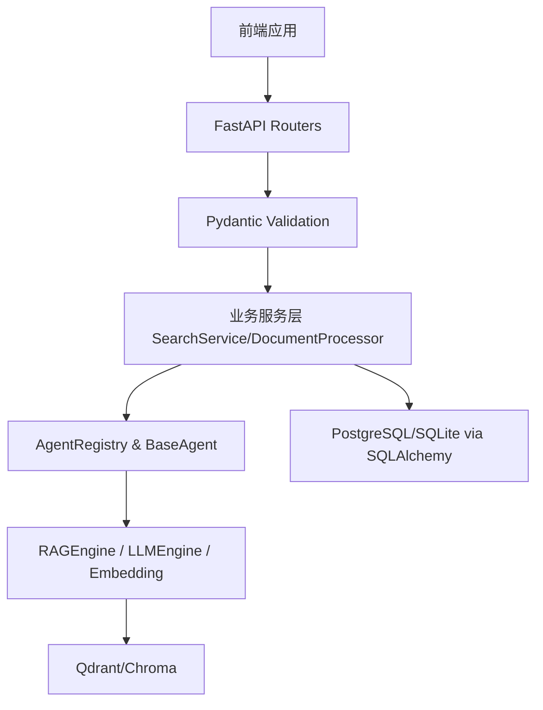

# SkyOne Shuge 架构设计 v3.0.6

## 1. 架构概览
天一阁 (SkyOne Shuge) 基于 **FastAPI** 和 **SQLAlchemy 2.0 (Async)**，架构分层演进到 v3.0.6。现在，核心系统被拆分为三大模块栈：
1. **API / 业务层** (`api/routers`)
2. **AI 服务与 Agent 层** (`services/` & `agents/`)
3. **ML 底层支撑引擎** (`ml/`)

在 v3.0.6 迭代中，我们将底层的核心逻辑：
- `ml/rag.py` (RAGEngine)
- `services/search_service.py` (SearchService)
- `ml/llm.py` & `ml/embedding.py`
成功与 API 网络层完成对接。

## 2. API 层模块拆解 (FastAPI Routers)
- **文档与分类管理**: `documents.py` & `categories.py`
- **搜索服务**: `search.py` & `advanced_search.py`
- **后台与批量任务**: `batch.py` & `tasks.py`
- **AI与大模型**: `rag.py` & `models.py`
- **系统与分析**: `health.py` & `analytics.py` & `auth.py`

## 3. Schemas 数据交换层设计
为了统一接口返回格式，将所有入参/出参分离到 `schemas/` 下。新增：
- `rag.py`: RAG/问答相关的数据。
- `tasks.py`: 异步任务状态机。
- `ml.py`: AI模型的状态、可用性。
- `analytics.py`: 数据看板、指标追踪、资源使用情况。

## 4. 异步架构演进
- 对于需要长时间运行的文档解析、Embedding 生成任务，不再阻断请求响应线程，而是使用 `FastAPI BackgroundTasks` 或未来集成的任务系统（如 Celery + Redis）进行解耦，前端通过 `/tasks/{task_id}` 进行轮询进度。

## 5. 组件交互链路

## 6. 技术栈
- **框架**: Python 3.10+, FastAPI
- **ORM**: Async SQLAlchemy 2.0
- **验证**: Pydantic V2
- **向量**: Qdrant / Chroma / Pinecone (可插拔)
- **大模型**: Ark (Doubao), OpenAI, Anthropic (可插拔)
