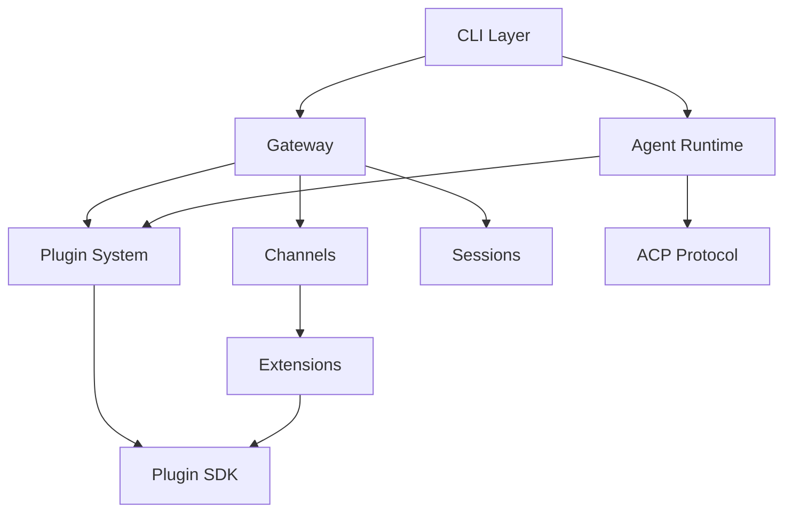
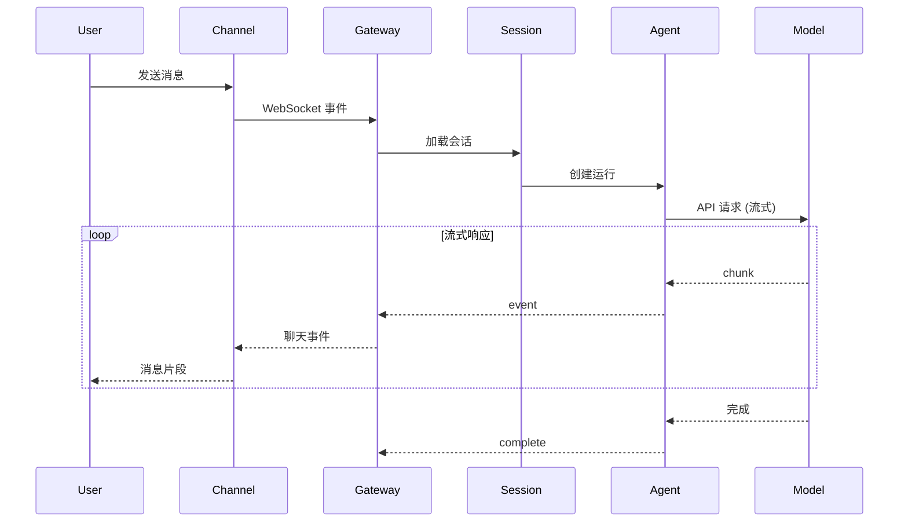

# OpenClaw 完整技术分析报告

**仓库：** https://github.com/openclaw/openclaw
**研究日期：** 2026-03-24
**报告版本：** v1.0
**研究者：** Claude AI Agent (GLM-5[1m])

---

## 📋 执行摘要

### 项目是什么
**OpenClaw 是一个本地优先的个人 AI 助手**，可以在你自己的设备上运行，通过 WhatsApp、Telegram、Discord 等 20+ 消息渠道与你交互，并能执行真实任务（运行命令、浏览网页、控制设备）。

### 解决什么问题
- **隐私控制**：商业 AI 服务需要数据上云，OpenClaw 在本地运行
- **渠道碎片化**：不同消息应用需要不同的 AI 工具，OpenClaw 统一入口
- **AI 能力受限**：大多数 AI 只能对话，OpenClaw 可以执行实际任务
- **定制困难**：商业 AI 难以深度定制，OpenClaw 提供完整插件系统

### 技术成熟度
⭐⭐⭐⭐☆ (稳定/生产可用)

### 综合评分
**总分: 4.25 / 5.0** ⭐⭐⭐⭐

---

## 🏷️ 第一章：项目身份与定位

### 基本信息
| 指标 | 值 |
|------|-----|
| 开源协议 | MIT License |
| 主语言 | TypeScript (98%+) |
| 最新版本 | 2026.3.24 |
| 运行时要求 | Node.js 22.16+ (推荐 24) |
| Stars | 活跃增长中 |
| 贡献者 | 20+ 核心维护者 |

### 同类项目对比
| 维度 | OpenClaw | LangChain | AutoGen | CrewAI |
|------|----------|-----------|---------|--------|
| 定位 | 个人 AI 助手 | LLM 框架 | 多代理框架 | 团队代理框架 |
| 消息渠道 | 20+ 原生 | 无内置 | 无内置 | 无内置 |
| 本地优先 | ✅ 是 | ❌ 否 | ❌ 否 | ❌ 否 |
| 移动应用 | ✅ 3 平台 | ❌ 无 | ❌ 无 | ❌ 无 |

---

## 🔧 第二章：技术栈与架构

### 技术栈速览
```
运行时: Node.js 24 (推荐) / Node.js 22.16+
语言: TypeScript 5.9+
框架: Express 5.x + Hono 4.x + WebSocket (ws 8.x)
构建: tsdown 0.21.x (基于 esbuild)
测试: Vitest 4.x + Playwright
包管理: pnpm 10.32.1 (monorepo)
```

### 架构模式识别
**主要模式：** 插件架构 + 模块化单体 + 事件驱动

### 模块依赖关系


### 核心组件
| 组件 | 目录 | 职责 |
|------|------|------|
| Gateway | `src/gateway/` | WebSocket 控制平面 |
| Agent Runtime | `src/agents/` | AI 代理执行 |
| ACP | `src/acp/` | Agent Client Protocol |
| Plugins | `src/plugins/` | 插件系统 |
| Channels | `src/channels/` | 消息渠道核心 |

---

## ⚙️ 第三章：核心功能解析

### 功能矩阵
| 功能 | 重要性 | 实现文件 | 完成度 |
|------|--------|---------|--------|
| Agent 执行引擎 | 🔴 核心 | `src/agents/` | ✅ 完整 |
| 消息发送/接收 | 🔴 核心 | `src/agents/tools/message-tool.ts` | ✅ 完整 |
| 会话管理 | 🔴 核心 | `src/sessions/` | ✅ 完整 |
| 渠道适配 | 🔴 核心 | `extensions/*/` | ✅ 20+ 渠道 |
| 浏览器控制 | 🟡 重要 | `src/agents/tools/browser-tool.ts` | ✅ 完整 |

### TOP 5 核心功能
1. **Agent 执行引擎** - 接收用户消息、调用 AI 模型、执行工具
2. **消息发送工具** - 通过任意已配置渠道发送消息
3. **会话管理系统** - 管理对话上下文、状态持久化、会话隔离
4. **浏览器控制** - 控制专用浏览器实例执行网页操作
5. **渠道适配系统** - 20+ 消息渠道的统一适配层

---

## 🌊 第四章：数据流与状态管理

### 主请求时序图


### 数据存储位置
| 数据类型 | 存储位置 | 格式 |
|---------|---------|------|
| 配置 | `~/.openclaw/openclaw.json` | JSON5 |
| 会话映射 | `~/.openclaw/sessions/` | JSON |
| 会话脚本 | `~/.openclaw/transcripts/` | JSONL |
| 凭据 | `~/.openclaw/credentials/` | 加密 JSON |
| 工作空间 | `~/.openclaw/workspace/` | 文件系统 |

### 安全机制
1. **多层认证**：Token + Password 双模式
2. **密钥引用**：环境变量、文件引用、命令执行
3. **输入净化**：防止 XSS 和注入攻击
4. **SSRF 防护**：内网地址和本地地址防护

---

## 📊 第五章：技术评估

### 工程实践评分卡
| 维度 | 评分 | 证据 |
|------|------|------|
| 代码风格一致性 | ✅ 优秀 | oxlint + oxfmt 配置完整 |
| 类型安全 | ✅ 优秀 | TypeScript strict 模式 |
| 测试覆盖 | ⚠️ 良好 | ~65% 覆盖率 |
| CI/CD | ✅ 优秀 | 完整 GitHub Actions |
| 文档质量 | ✅ 良好 | Mintlify 文档站点 |
| 安全实践 | ✅ 优秀 | 多层认证、沙箱 |
| 社区健康 | ✅ 优秀 | Issue/PR 模板齐全 |

### 红旗与亮点
#### 🚩 红旗 (潜在问题)
1. **配置复杂度**：大量配置项可能让新用户困惑
2. **依赖数量庞大**：70+ 扩展包，依赖管理复杂
3. **平台特定功能**：某些功能仅限 macOS/iOS

#### ⭐ 亮点
1. **架构设计**：清晰的分层架构，插件系统设计优秀
2. **安全优先**：多层认证、沙箱、SSRF 防护
3. **文档完善**：详尽的文档和 CHANGELOG
4. **社区活跃**：20+ 核心维护者，活跃的 Discord

### 改进建议
#### 短期 (1-3 个月)
1. 增加 E2E 测试覆盖
2. 完善架构决策记录 (ADR)
3. 简化配置，考虑配置向导

#### 中期 (3-6 个月)
1. 性能优化：监控和优化启动时间、内存使用
2. 文档国际化：考虑多语言文档支持
3. 可观测性：增强监控和诊断能力

#### 长期 (6-12 个月)
1. 插件市场：完善 ClawHub 生态系统
2. 企业特性：考虑多租户、RBAC 等企业需求
3. 性能基准：建立性能基准测试套件

---

## 🚀 第六章：部署与运维

### 部署方法分析
| 方法 | 优点 | 缺点 | 适用场景 |
|------|------|------|---------|
| **NPM 全局安装** | 最简单，自动处理依赖 | 无法修改源码 | 个人使用，快速入门 |
| **Docker 部署** | 环境隔离，易于版本管理 | 需要理解 Docker | 生产环境，沙箱模式 |
| **源码构建** | 可修改源码，最新功能 | 构建时间较长 | 开发调试，二次开发 |
| **Nix 模式** | 声明式配置，可重现环境 | 需要学习 Nix | 高级用户，可重现部署 |

### 快速启动（开发环境）
```bash
# 安装
npm install -g openclaw@latest

# 引导设置
openclaw onboard --install-daemon

# 启动 Gateway
openclaw gateway --port 18789 --verbose

# 与 AI 对话
openclaw agent --message "Hello!"
```

### 配置参考
```json5
{
 agent: {
 model: "anthropic/claude-opus-4-6",
 },
 gateway: {
 bind: "loopback",
 port: 18789,
 auth: {
 mode: "token",
 token: { $env: "OPENCLAW_GATEWAY_TOKEN" },
 },
 },
 channels: {
 telegram: {
 botToken: { $env: "TELEGRAM_BOT_TOKEN" },
 allowFrom: ["*"],
 },
 },
}
```

### 运维手册
1. **健康检查端点**
   - `/healthz` - 简单健康检查
   - `/readyz` - 就绪检查
   - `/status` - 详细状态

2. **日志管理**
   - Gateway 日志: `~/.openclaw/logs/`
   - 日志级别: debug, info (默认), warn, error

3. **备份与恢复**
   ```bash
   # 创建备份
   openclaw backup create
   
   # 恢复备份
   openclaw backup restore <backup-id>
   ```

4. **故障排除**
   ```bash
   # 运行诊断
   openclaw doctor
   
   # 检查特定问题
   openclaw doctor --check auth
   openclaw doctor --check channels
   ```

---

## 📚 第七章：学习路径与贡献指南

### 分阶段学习路线
#### 🟢 Phase 1: 定向 (Week 1-2)
**目标:** 理解项目是什么，为什么存在，如何运行

**阅读清单:**
1. README.md - 项目定位、安装步骤、快速开始
2. VISION.md - 项目方向、设计哲学
3. CONTRIBUTING.md - 贡献流程、代码规范

**动手任务:**
- [ ] 安装 Node.js 24 和 pnpm
- [ ] 运行 `openclaw onboard`
- [ ] 配置一个模型提供商
- [ ] 在终端中与 Agent 对话

#### 🟡 Phase 2: 核心概念 (Week 3-5)
**目标:** 理解核心机制和主要用例

**代码阅读路径:**
1. `src/entry.ts` → CLI 入口点
2. `src/gateway/server.impl.ts` → Gateway 核心
3. `src/sessions/` → 会话管理
4. `src/agents/` → Agent 执行
5. `src/agents/tools/` → 工具实现

**深入模块:**
1. 插件系统 (`src/plugins/`)
2. 渠道适配 (`extensions/telegram/`)
3. 配置系统 (`src/config/`)

#### 🔴 Phase 3: 深度掌握 (Week 6-10)
**目标:** 理解高级功能、内部机制，准备贡献

**高级主题:**
1. ACP 协议 (`src/acp/`)
2. 沙箱机制 (`src/security/`)
3. 内存系统 (`src/memory/`)
4. 浏览器自动化 (`src/browser/`)

**贡献路径:**
```bash
# 1. 设置开发环境
git clone https://github.com/openclaw/openclaw.git
cd openclaw
pnpm install
pnpm build

# 2. 寻找适合的任务
# 访问 https://github.com/openclaw/openclaw/issues?q=is%3Aissue+is%3Aopen+label%3A%22good+first+issue%22

# 3. 创建分支
git checkout -b feature/my-contribution

# 4. 开发和测试
pnpm test:changed

# 5. 提交 PR
```

### 代码阅读推荐顺序
#### 第一周
1. `src/entry.ts` - 入口点
2. `src/index.ts` - 库导出
3. `src/runtime.ts` - 运行时环境
4. `src/config/config.ts` - 配置入口
5. `src/cli/run-main.js` - CLI 主入口

#### 第二周
1. `src/gateway/server.impl.ts` - Gateway 核心
2. `src/gateway/auth.ts` - 认证
3. `src/sessions/` - 会话管理
4. `src/gateway/server-chat.ts` - 聊天处理

#### 第三周
1. `src/agents/` - Agent 系统
2. `src/agents/tools/` - 工具实现
3. `src/plugins/` - 插件系统
4. `src/channels/` - 渠道核心

#### 第四周+
1. `src/acp/` - ACP 协议
2. `src/security/` - 安全系统
3. `src/cron/` - 定时任务
4. `extensions/` - 扩展实现

### 快速胜利 (Quick Win)
**任务: 添加一个新的聊天命令**

1. **找到命令处理位置**
   ```typescript
   // src/gateway/server-chat.ts 或相关文件
   ```

2. **添加命令解析**
   ```typescript
   if (content.startsWith("/mycommand")) {
     // 处理逻辑
     return "My command executed!";
   }
   ```

3. **测试**
   ```bash
   pnpm test:changed
   ```

4. **提交**
   - 创建分支
   - 提交 PR
   - 等待审查

**预计时间:** 1-2 小时

---

## 🏆 第八章：综合总结

### 最大亮点 TOP 3
1. **20+ 消息渠道**：统一入口，覆盖主流平台
2. **本地优先设计**：隐私和安全是核心考量
3. **完善的插件系统**：高度可扩展，70+ 扩展包

### 推荐指数
| 场景 | 推荐度 |
|------|--------|
| 个人使用 | ✅ 强烈推荐 |
| 生产部署 | ✅ 推荐 (需评估安全需求) |
| 二次开发 | ✅ 强烈推荐 |
| 学习研究 | ✅ 强烈推荐 |

### 适用场景
1. **个人生产力**：日常任务自动化、信息检索、日程管理
2. **开发者工具**：代码辅助、文档生成、调试支持
3. **家庭自动化**：IoT 控制、智能家居集成

### 技术选择评估
| 技术 | 使用版本 | 当前稳定版 | 状态 | 风险评估 |
|------|---------|-----------|------|---------|
| Node.js | 22.16+ / 24 (推荐) | 24.x | ✅ 最新 | 低 |
| TypeScript | 5.9.3 | 5.9.x | ✅ 最新 | 低 |
| pnpm | 10.32.1 | 10.x | ✅ 最新 | 低 |
| Express | 5.2.1 | 5.x | ✅ 最新 | 低 |

### 关键依赖评估
| 依赖 | 版本 | 用途 | 风险 | 建议 |
|------|------|------|------|------|
| `@modelcontextprotocol/sdk` | 1.27.1 | MCP 协议 | 低 | 保持更新 |
| `@agentclientprotocol/sdk` | 0.16.1 | ACP 协议 | 中 | 关注版本稳定性 |
| `@mariozechner/pi-*` | 0.61.1 | Agent 运行时 | 中 | 内部依赖，需关注 |
| `playwright-core` | 1.58.2 | 浏览器自动化 | 低 | 定期更新 |

---

## 📝 报告文件清单

本报告系列包含以下文件：

1. `chapter1-overview.md` - 项目概述与身份分析
2. `chapter2-architecture.md` - 架构深度分析
3. `chapter3-features.md` - 功能与业务逻辑分析
4. `chapter4-dataflow.md` - 数据流与状态管理分析
5. `chapter5-assessment.md` - 技术评估报告
6. `chapter6-deployment.md` - 部署与运维指南
7. `chapter7-learning.md` - 学习路径与贡献指南
8. `chapter8-comprehensive.md` - 综合深度研究报告

---

## 🔗 相关资源

| 资源 | URL | 最佳用途 |
|------|-----|---------|
| **官网** | https://openclaw.ai | 项目概览 |
| **文档** | https://docs.openclaw.ai | 详细配置和使用 |
| **Discord** | https://discord.gg/clawd | 社区支持、讨论 |
| **GitHub** | https://github.com/openclaw/openclaw | 源码、Issues、PRs |
| **ClawHub** | https://clawhub.ai | 技能市场 |

### Discord 频道指南
| 频道 |